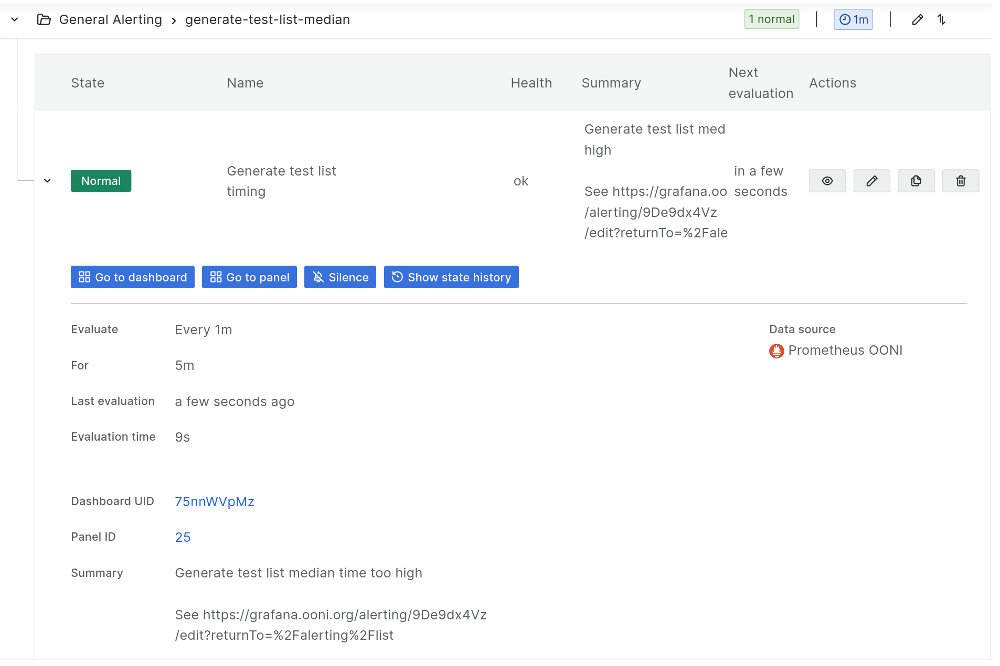

## Incident response

### On-call preparation
Review [Alerting](#alerting)&thinsp;💡 and check
[Grafana dashboards](#grafana-dashboards)&thinsp;💡

On Android devices the following apps can be used:

 * [Slack](#slack)&thinsp;🔧 app with audible notifications from the
    #ooni-bots channel

 * [Grafana](#grafana)&thinsp;🔧 viewer
    <https://play.google.com/store/apps/details?id=it.ksol.grafanaview>

### Tiers and severities

When designing architecture of backend components or handling incidents it can be useful to have
defined severities and tiers.

A set of guidelines are described at <https://google.github.io/building-secure-and-reliable-systems/raw/ch16.html#establish_severity_and_priority_models>
This section presets a simplified approach to prioritizing incident response.

In this case there is no distinction between severity and priority. Impact and response time are connected.

Incidents and alarms from monitoring can be classified by severity levels based on their impact:

 - 1: Serious security breach or data loss; serious loss of privacy impacting users or team members; legal risks.
 - 2: Downtime impacting service usability for a significant fraction of users; Serious security vulnerability.
      Examples: probes being unable to submit measurements
 - 3: Downtime or poor performance impacting secondary services; anything that can cause a level 2 event if not addressed within 24h; outages of monitoring infrastructure
 - 4: Every other event that requires attention within 7 days

Based on the set of severities, components can be classified in tier as follows:

 - tier 1: Anything that can cause a severity 1 (or less severe) event.
 - tier 2: Anything that can cause a severity 2 (or less severe) event but not a severity 1.
 - tier 3: Anything that can cause a severity 3 (or less severe) event but not a severity 1 or 2.
 - ...and so on

#### Relations and dependencies between services

Tiers are useful during design and deployment as a way to minimize risk of outages and avoid unexpected cascading failures.

Having a low tier value should not be treated as a sign of "importance" for a component, but a liability.

Pre-production deployment stages (e.g. testbed) have tier level >= 5

In this context a component can be a service as a whole, or a running process (daemon), a host, a hardware device, etc.
A component can contain other components.

A component "A" is said to "hard depend" on another component "B" if an outage of B triggers an outage of A.

It can also "soft depend" on another component if an outage of the latter triggers only a failure of a subsystem, or an ancillary feature or a reasonably short downtime.

Regardless of tiers, components at a higher stage, (e.g. production) cannot depend and/or receive data from lower stages. The opposite is acceptable.

Components can only hard-depend on other components at the same tier or with lower values.
E.g. a Tier 2 component can depend on a Tier 1 but not the other way around.
If it happens, the Tier 2 component should be immediatly re-classified as Tier 1 and treated accordingly (see below).

E.g. anything that handles real-time failover for a service should be treated at the same tier (or lower value) as the service.

Redundant components follow a special rule. For example, the "test helper" service provided to the probes, as a whole, should be considered tier 2 at least,
as it can impact all probes preventing them from running tests succesfully.
Yet, test helper processes and VMs can be considered tier 3 or even 4 if they sit behind a load balancer that can move traffic away from a failing host reliably
and with no significant downtime.

Example: An active/standby database pair provides a tier 2 service. An automatic failover tool is triggered by a simple monitoring script.
Both have to be labeled tier 2.


#### Handling incidents

Depending on the severity of an event a different workflow can be followed.

An example of incident management workflow can be:

| Severity | Response time | Requires conference call | Requires call leader | Requires postmortem | Sterile |
| -------- | ------- | ------ | -------- | ------- | ------ |
| 1 | 2h | Yes | Yes | Yes | Yes |
| 2 | 8h | Yes | No | Yes | Yes |
| 3 | 24h | No | No | No | Yes |
| 4 | 7d | No | No | No | No |

The term "sterile" is named after <https://en.wikipedia.org/wiki/Sterile_flight_deck_rule> - during the investigation the only priority should be to solve the issue at hand.
Other investigations, discussions, meetings should be postponed.

When in doubt around the severity of an event, always err on the safe side.


#### Regular operations

Based on the tier of a component, development and operation can follow different rules.

An example of incident management workflow can be:

| Tier | Require architecture review | Require code review | Require 3rd party security review | Require Change Management |
| -------- | ------- | ------ | -------- | ------- |
| 1 | Yes | Yes | Yes | Yes |
| 2 | Yes | Yes | No | No |
| 3 | No | Yes | No | No |
| 4 | No | No | No | No |

"Change Management" refers to planning operational changes in advance and having team members review the change to be deployed in advance.

E.g. scheduling a meeting to perform a probe release, have 2 people reviewing the metrics before and after the change.


### Redundant notifications
If needed, a secondary channel for alert notification can be set up
using <https://ntfy.sh/>

Ntfy can host a push notification topic for free.

For example <https://ntfy.sh/ooni-7aGhaS> is currently being used to
notify the outcome of CI runs from
<https://github.com/ooni/backend/blob/0ec9fba0eb9c4c440dcb7456f2aab529561104ae/.github/workflows/test_new_api.yml>

An Android app is available:
<https://f-droid.org/en/packages/io.heckel.ntfy/>

[Grafana](#grafana)&thinsp;🔧 can be configured to send alerts to ntfy.sh
using a webhook.


### Test helper rotation runbook
This runbook provides hints to troubleshoot the rotation of test
helpers. In this scenario test helpers are not being rotated as expected
and their TLS certificates might be at risk of expiring.

Steps:

1.  Review [Test helpers](#comp:test_helpers), [Test helper rotation](#comp:test_helper_rotation) and [Test helpers notebook](#test-helpers-notebook)&thinsp;📔

2.  Review the charts on [Test helpers dashboard](#test-helpers-dashboard)&thinsp;📊.
    Look at different timespans:

    a.  The uptime of the test helpers should be staggered by a week
        depending on [Test helper rotation](#test-helper-rotation)&thinsp;⚙.

3.  A summary of the live and last rotated test helper can be obtained
    with:

```sql
SELECT rdn, dns_zone, name, region, draining_at FROM test_helper_instances ORDER BY name DESC LIMIT 8
```

4.  The rotation tool can be started manually. It will always pick the
    oldest host for rotation. ⚠️ Due to the propagation time of changes
    in the DNS rotating many test helpers too quickly can impact the
    probes.

    a.  Log on [backend-fsn.ooni.org](#backend-fsn.ooni.org)&thinsp;🖥

    b.  Check the last run using
        `sudo systemctl status ooni-rotation.timer`

    c.  Review the logs using `sudo journalctl -u ooni-rotation`

    d.  Run `sudo systemctl restart ooni-rotation` and monitor the logs.

5.  Review the charts on [Test helpers dashboard](#test-helpers-dashboard)&thinsp;📊
    during and after the rotation.


### Test helpers failure runbook
This runbook presents a scenario where a test helper is causing probes
to fail their tests sporadically. It describes how to identify the
affected host and mitigate the issue but can also be used to investigate
other issues affecting the test helpers.

It has been chosen because such kind of incidents can impact the quality
of measurements and can be relatively difficult to troubleshoot.

For investigating glitches in the
[test helper rotation](#test-helper-rotation)&thinsp;⚙ see
[test helper rotation runbook](#test-helper-rotation-runbook)&thinsp;📒.

In this scenario either an alert has been sent to the
[#ooni-bots](#topic:oonibots) [Slack](#slack)&thinsp;🔧 channel by
the [test helper failure rate notebook](#test-helper-failure-rate-notebook)&thinsp;📔 or something
else caused the investigation.
See [Alerting](#alerting)&thinsp;💡 for details.

Steps:

1.  Review [Test helpers](#test-helpers)&thinsp;⚙

2.  Review the charts on [Test helpers dashboard](#test-helpers-dashboard)&thinsp;📊.
    Look at different timespans:

    a.  The uptime of the test helpers should be staggered by a week
        depending on [Test helper rotation](#test-helper-rotation)&thinsp;⚙.

    b.  The in-flight requests and requests per second should be
        consistent across hosts, except for `0.th.ooni.org`. See
        [Test helpers list](#test-helpers-list)&thinsp;🐝 for details.

    c.  Review CPU load, memory usage and run duration percentiles.

3.  Review [Test helper failure rate notebook](#test-helper-failure-rate-notebook)&thinsp;📔

4.  For more detailed investigation there is also a [test helper notebook](https://jupyter.ooni.org/notebooks/notebooks/2023%20%5Bfederico%5D%20test%20helper%20metadata%20in%20fastpath.ipynb)

5.  Log on the hosts using
    `ssh -o StrictHostKeyChecking=no -o UserKnownHostsFile=/dev/null -Snone root@0.th.ooni.org`

6.  Run `journalctl --since '1 hour ago'` or review logs using the query
    below.

7.  Run `top`, `strace`, `tcpdump` as needed.

8.  The rotation tool can be started at any time to rotate away failing
    test helpers. The rotation script will always pick the oldest host
    for rotation. ⚠️ Due to the propagation time of changes in the DNS
    rotating many test helpers too quickly can impact the probes.

    a.  Log on [backend-fsn.ooni.org](#backend-fsn.ooni.org)&thinsp;🖥

    b.  Check the last run using
        `sudo systemctl status ooni-rotation.timer`

    c.  Review the logs using `sudo journalctl -u ooni-rotation`

    d.  Run `sudo systemctl restart ooni-rotation` and monitor the logs.

9.  Review the charts on [Test helpers dashboard](#test-helpers-dashboard)&thinsp;📊
    during and after the rotation.

10. Summarize traffic hitting a test helper using the following commands:

    Top 10 miniooni probe IP addresses (Warning: this is sensitive data)

    `tail -n 100000 /var/log/nginx/access.log | grep miniooni | cut -d' ' -f1|sort|uniq -c|sort -nr|head`

    Similar, with anonimized IP addresses:

    `grep POST /var/log/nginx/access.log | grep miniooni | cut -d'.' -f1-3 | head -n 10000 |sort|uniq -c|sort -nr|head`

    Number of requests from miniooni probe in 10-minutes buckets:

    `grep POST /var/log/nginx/access.log | grep miniooni | cut -d' ' -f4 | cut -c1-17 | uniq -c`

    Number of requests from miniooni probe in 1-minute buckets:

    `grep POST /var/log/nginx/access.log | grep miniooni | cut -d' ' -f4 | cut -c1-18 | uniq -c`

    Number of requests grouped by hour, cache HIT/MISS/etc, software name and version

    `head -n 100000 /var/log/nginx/access.log | awk '{print $4, $6, $13}' | cut -c1-15,22- | sort | uniq -c | sort -n`

To extract data from the centralized log database
on [monitoring.ooni.org](#monitoring.ooni.org)&thinsp;🖥 you can use:

``` sql
SELECT message FROM logs
WHERE SYSLOG_IDENTIFIER = 'oohelperd'
ORDER BY __REALTIME_TIMESTAMP DESC
LIMIT 10
```

> **note**
> The table is indexed by `__REALTIME_TIMESTAMP`. Limiting the range by time can significantly increase query performance.


See [Selecting test helper for rotation](#selecting-test-helper-for-rotation)&thinsp;🐞


### Measurement drop tutorial
This tutorial provides examples on how to investigate a drop in measurements.
It is based on an incident where a drop in measurement was detected and the cause was not immediately clear.

It is not meant to be a step-by-step runbook but rather give hints on what data to look for, how to generate charts and identify the root cause of an incident.

A dedicated issue can be used to track the incident and the investigation effort and provide visibility:
https://github.com/ooni/sysadmin/blob/master/.github/ISSUE_TEMPLATE/incident.md
The issue can be filed during or after the incident depending on urgency.

Some of the examples below come from
https://jupyter.ooni.org/notebooks/notebooks/android_probe_release_msm_drop_investigation.ipynb
During an investigation it can be good to create a dedicated Jupyter notebook.

We started with reviewing:

 * <https://jupyter.ooni.org/view/notebooks/jupycron/autorun_android_probe_release.html>
   No issues detected as the charts show a short timespan.
 * The charts on [Test helpers dashboard](#test-helpers-dashboard)&thinsp;📊.
   No issues detected here.
 * The [API and fastpath](#api-and-fastpath)&thinsp;📊 dashboard.
   No issues detected here.
 * The [Long term measurements prediction notebook](#long-term-measurements-prediction-notebook)&thinsp;📔
   The decrease was clearly showing.

Everything looked OK in terms of backend health. We then generated the following charts.

The chunks of Python code below are meant to be run in
[Jupyter Notebook](#jupyter-notebook)&thinsp;🔧 and are mostly "self-contained".
To be used you only need to import the
[Ooniutils microlibrary](#ooniutils-microlibrary)&thinsp;💡:

``` python
%run ooniutils.ipynb
```

The "t" label is commonly used on existing notebooks to refer to hour/day/week time slices.

We want to plot how many measurements we are receiving from Ooniprobe Android in unattended runs, grouped by day and by `software_version`.

The last line generates an area chart using Altair. Notice that the `x` and `y` and `color` parameters match the 3 columns extracted by the `SELECT`.

The `GROUP BY` is performed on 2 of those 3 columns, while `COUNT(*)` is counting how many measurements exist in each t/software_version "bucket".

The output of the SQL query is just a dataframe with 3 columns. There is no need to pivot or reindex it as Altair does the data transformation required.

> **note**
> Altair refuses to process dataframes with more than 5000 rows.

``` python
x = click_query("""
    SELECT
      toStartOfDay(toStartOfWeek(measurement_start_time)) AS t,
      software_version,
      COUNT(*) AS msm_cnt
    FROM fastpath
    WHERE measurement_start_time > today() - interval 3 month
    AND measurement_start_time < today()
    AND software_name = 'ooniprobe-android-unattended'
    GROUP BY t, software_version
""")
alt.Chart(x).mark_area().encode(x='t', y='msm_cnt', color='software_version').properties(width=1000, height=200, title="Android unattended msm cnt")
```

The generated chart was:


From the chart we concluded that the overall number of measurements have been decreasing since the release of a new version.
We also re-ran the plot by filtering on other `software_name` values and saw no other type of probe was affected.

> **note**
> Due to a limitation in Altair, when grouping time by week use
> `toStartOfDay(toStartOfWeek(measurement_start_time)) AS t`

Then we wanted to measure how many measurements are being collected during each `web_connectivity` test run.
This is to understand if probes are testing less measurements in each run.

The following Python snippet uses nested SQL queries. The inner query groups measurements by time, `software_version` and `report_id`,
and counts how many measurements are related to each `report_id`.
The outer query "ignores" the `report_id` value and `quantile()` is used to extract the 50 percentile of `msm_cnt`.

> **note**
> The use of double `%%` in `LIKE` is required to escape the `%` wildcard. The wildcard is used to match any amount of characters.

``` python
x = click_query("""
    SELECT
        t,
        quantile(0.5)(msm_cnt) AS msm_cnt_p50,
        software_version
    FROM (
        SELECT
            toStartOfDay(toStartOfWeek(measurement_start_time)) AS t,
            software_version,
            report_id,
            COUNT(*) AS msm_cnt
        FROM fastpath
        WHERE measurement_start_time > today() - interval 3 month
        AND test_name = 'web_connectivity'
        AND measurement_start_time < today()
        AND software_name = 'ooniprobe-android-unattended'
        AND software_version LIKE '3.8%%'
        GROUP BY t, software_version, report_id
    ) GROUP BY t, software_version
""")
alt.Chart(x).mark_line().encode(x='t', y='msm_cnt_p50', color='software_version').properties(width=1000, height=200, title="Android unattended msmt count per report")
```

We also compared different version groups and different `software_name`.
The output shows that indeed the number of measurements for each run is significantly lower for the newly released versions.


To update the previous Python snippet to group measurements by a different field, change `software_version` into the new column name.
For example use `probe_cc` to show a chart with a breakdown by probe country name. You should change `software_version` once in each SELECT part,
then in the last two `GROUP BY`, and finally in the `color` line at the bottom.

We did such change to confirm that all countries were impacted in the same way. (The output is not included here as not remarkable)

Also, `mark_line` on the bottom line is used to create line charts. Switch it to `mark_area` to generate *stacked* area charts.
See the previous two charts as examples.

We implemented a change to the API to improve logging the list of tests returned at check-in: <https://github.com/ooni/backend/pull/781>
and reviewed monitored the logs using `sudo journalctl -f -u ooni-api`.

The output showed that the API is very often returning 100 URLs to probes.

We then ran a similar query to extract the test duration time by calculating
`MAX(measurement_start_time) - MIN(measurement_start_time) AS delta` for each `report_id` value:

``` python
x = click_query("""
    SELECT t, quantile(0.5)(delta) AS deltaq, software_version
    FROM (
        SELECT
            toStartOfDay(toStartOfWeek(measurement_start_time)) AS t,
            software_version,
            report_id,
            MAX(measurement_start_time) - MIN(measurement_start_time) AS delta
        FROM fastpath
        WHERE measurement_start_time > today() - interval 3 month
        AND test_name = 'web_connectivity'
        AND measurement_start_time < today()
        AND software_name = 'ooniprobe-android-unattended'
        AND software_version LIKE '3.8%%'
        GROUP BY t, software_version, report_id
    ) GROUP BY t, software_version
""")
alt.Chart(x).mark_line().encode(x='t', y='deltaq', color='software_version').properties(width=1000, height=200, title="Android unattended test run time")
```


The chart showed that the tests are indeed running for a shorter amount of time.

> **note**
> Percentiles can be more meaningful then averages.
> To calculate quantiles in ClickHouse use `quantile(<fraction>)(<column_name>)`.

Example:

``` sql
quantile(0.1)(delta) AS deltaq10
```

Wondering if the slowdown was due to slower measurement execution or other issues, we also generated a table as follows.

> **note**
> Showing color bars allows to visually inspect tables more quickly. Setting the axis value to `0`, `1` or `None` helps readability:
> `y.style.bar(axis=None)`

Notice the `delta / msmcnt AS seconds_per_msm` calculation:

``` python
y = click_query("""
    SELECT
        quantile(0.1)(delta) AS deltaq10,
        quantile(0.3)(delta) AS deltaq30,
        quantile(0.5)(delta) AS deltaq50,
        quantile(0.7)(delta) AS deltaq70,
        quantile(0.9)(delta) AS deltaq90,

        quantile(0.5)(seconds_per_msm) AS seconds_per_msm_q50,
        quantile(0.5)(msmcnt) AS msmcnt_q50,

    software_version, software_name
    FROM (
        SELECT
            software_version, software_name,
            report_id,
            MAX(measurement_start_time) - MIN(measurement_start_time) AS delta,
            count(*) AS msmcnt,
            delta / msmcnt AS seconds_per_msm
        FROM fastpath
        WHERE measurement_start_time > today() - interval 3 month
        AND test_name = 'web_connectivity'
        AND measurement_start_time < today()
        AND software_name IN ['ooniprobe-android-unattended', 'ooniprobe-android']
        AND software_version LIKE '3.8%%'
        GROUP BY software_version, report_id, software_name
    ) GROUP BY software_version, software_name
    ORDER by software_version, software_name ASC
""")
y.style.bar(axis=None)
```


In the table we looked at the `seconds_per_msm_q50` column: the median time for running each test did not change significantly.

To summarize:
 * The backend appears to deliver the same amount of URLs to the Probes as usual.
 * The time required to run each test is rougly the same.
 * Both the number of measurements per run and the run time decreased in the new releases.


### Weekly measurements review runbook
On a daily or weekly basis the following dashboards and Jupyter notebooks can be reviewed to detect unexpected patterns in measurements focusing on measurement drops, slowdowns or any potential issue affecting the backend infrastructure.

When browsing the dashboards expand the time range to one year in order to spot long term trends.
Also zoom in to the last month to spot small glitches that could otherwise go unnoticed.

Review the [API and fastpath](#api-and-fastpath)&thinsp;📊 dashboard for the production backend host[s] for measurement flow, CPU and memory load,
timings of various API calls, disk usage.

Review the [Incoming measurements notebook](#incoming-measurements-notebook)&thinsp;📔 for unexpected trends.

Quickly review the following dashboards for unexpected changes:

 * [Long term measurements prediction notebook](#long-term-measurements-prediction-notebook)&thinsp;📔
 * [Test helpers dashboard](#test-helpers-dashboard)&thinsp;📊
 * [Test helper failure rate notebook](#test-helper-failure-rate-notebook)&thinsp;📔
 * [Database backup dashboard](#database-backup-dashboard)&thinsp;📊
 * [GeoIP MMDB database dashboard](#geoip-mmdb-database-dashboard)&thinsp;📊
 * [GeoIP dashboard](#geoip-mmdb-database-dashboard)&thinsp;📊
 * [Fingerprint updater dashboard](#fingerprint-updater-dashboard)&thinsp;📊
 * [ASN metadata updater dashboard](#asn-metadata-updater-dashboard)&thinsp;📊

Also check <https://jupyter.ooni.org/view/notebooks/jupycron/summary.html> for glitches like notebooks not being run etc.


### Grafana backup runbook
This runbook describes how to back up dashboards and alarms in Grafana.
It does not include backing up datapoints stored in
[Prometheus](#prometheus)&thinsp;🔧.

The Grafana SQLite database can be dumped by running:

```bash
sqlite3 -line /var/lib/grafana/grafana.db '.dump' > grafana_dump.sql
```

Future implementation is tracked in:
[Implement Grafana dashboard and alarms backup](#implement-grafana-dashboard-and-alarms-backup)&thinsp;🐞


### Grafana editing
This runbook describes adding new dashboards, panels and alerts in
[Grafana](#grafana)&thinsp;🔧

To add a new dashboard use this
<https://grafana.ooni.org/dashboard/new?orgId=1>

To add a new panel to an existing dashboard load the dashboard and then
click the \"Add\" button on the top.

Many dashboards use variables. For example, on
<https://grafana.ooni.org/d/l-MQSGonk/api-and-fastpath-multihost?orgId=1>
the variables `$host` and `$avgspan` are set on the top left and used in
metrics like:

    avg_over_time(netdata_disk_backlog_milliseconds_average{instance="$host:19999"}[$avgspan])


#### Managing Grafana alert rules
Alert rules can be listed at <https://grafana.ooni.org/alerting/list>

> **note**
> The list also shows which alerts are currently alarming, if any.

Click the arrow on the left to expand each alerting rule.

The list shows:


> **note**
> When creating alerts it can be useful to add full URLs linking to
> dashboards, runbooks etc.

To stop notifications create a \"silence\" either:

1.  by further expanding an alert rule (see below) and clicking the
    \"Silence\" button

2.  by inputting it in <https://grafana.ooni.org/alerting/silences>

Screenshot:



Additionally, the \"Show state history\" button is useful especially
with flapping alerts.


### Geolocation script
The following script can be used to compare the geolocation reported by
the probes submitting measurements compared to the geolocation of the
`/24` subnet the probe is coming from. It is meant to be run on
[backend-fsn.ooni.org](#backend-fsn.ooni.org)&thinsp;🖥.

``` python
##!/usr/bin/env python3

from time import sleep

import systemd.journal
import geoip2.database  # type: ignore

asnfn = "/var/lib/ooniapi/asn.mmdb"
ccfn = "/var/lib/ooniapi/cc.mmdb"
geoip_asn_reader = geoip2.database.Reader(asnfn)
geoip_cc_reader = geoip2.database.Reader(ccfn)


def follow_journal():
    journal = systemd.journal.Reader()
    #journal.seek_tail()
    journal.get_previous()
    journal.add_match(_SYSTEMD_UNIT="nginx.service")
    while True:
        try:
            event = journal.wait(-1)
            if event == systemd.journal.APPEND:
                for entry in journal:
                    yield entry["MESSAGE"]
        except Exception as e:
            print(e)
            sleep(0.1)


def geolookup(ipaddr: str):
    cc = geoip_cc_reader.country(ipaddr).country.iso_code
    asn = geoip_asn_reader.asn(ipaddr).autonomous_system_number
    return cc, asn


def process(rawmsg):
    if ' "POST /report/' not in rawmsg:
        return
    msg = rawmsg.strip().split()
    ipaddr = msg[2]
    ipaddr2 = msg[3]
    path = msg[8][8:]
    tsamp, tn, probe_cc, probe_asn, collector, rand = path.split("_")
    geo_cc, geo_asn = geolookup(ipaddr)
    proxied = 0
    probe_type = rawmsg.rsplit('"', 2)[-2]
    if "," in probe_type:
        return
    if ipaddr2 != "0.0.0.0":
        proxied = 1
        # Probably CloudFront, use second ipaddr
        geo_cc, geo_asn = geolookup(ipaddr2)

    print(f"{probe_cc},{geo_cc},{probe_asn},{geo_asn},{proxied},{probe_type}")


def main():
    for msg in follow_journal():
        if msg is None:
            break
        try:
            process(msg)
        except Exception as e:
            print(e)
            sleep(0.1)


if __name__ == "__main__":
    main()
```


### Test list prioritization monitoring
The following script monitors prioritized test list for changes in URLs
for a set of countries. Outputs StatsS metrics.

> **note**
> The prioritization system has been modified to work on a granularity of
> probe_cc + probe_asn rather than whole countries.

Country-wise changes might be misleading. The script can be modified to
filter for a set of CCs+ASNs.

``` python
##!/usr/bin/env python3

from time import sleep
import urllib.request
import json

import statsd  # debdeps: python3-statsd

metrics = statsd.StatsClient("127.0.0.1", 8125, prefix="test-list-changes")

CCs = ["GE", "IT", "US"]
THRESH = 100


def peek(cc, listmap) -> None:
    url = f"https://api.ooni.io/api/v1/test-list/urls?country_code={cc}&debug=True"
    res = urllib.request.urlopen(url)
    j = json.load(res)
    top = j["results"][:THRESH]  # list of dicts
    top_urls = set(d["url"] for d in top)

    if cc in listmap:
        old = listmap[cc]
        changed = old.symmetric_difference(top_urls)
        tot_cnt = len(old.union(top_urls))
        changed_ratio = len(changed) / tot_cnt * 100
        metrics.gauge(f"-{cc}", changed_ratio)

    listmap[cc] = top_urls


def main() -> None:
    listmap = {}
    while True:
        for cc in CCs:
            try:
                peek(cc, listmap)
            except Exception as e:
                print(e)
            sleep(1)
        sleep(60 * 10)


if __name__ == "__main__":
    main()
```

### Recompressing postcans on S3
The following script can be used to compress .tar.gz files in the S3 data bucket.
It keeps a copy of the original files locally as a backup.
It terminates once a correctly compressed file is found.
Running the script on an AWS host close to the S3 bucket can significantly
speed up the process.

Tested with the packages:

  * python3-boto3  1.28.49+dfsg-1
  * python3-magic  2:0.4.27-2

Set the ACCESS_KEY and SECRET_KEY environment variables.
Update the PREFIX variable as needed.

```python
##!/usr/bin/env python3
from os import getenv, rename
from sys import exit
import boto3
import gzip
import magic

BUCKET_NAME = "ooni-data-eu-fra-test"
## BUCKET_NAME = "ooni-data-eu-fra"
PREFIX = "raw/2021"

def fetch_files():
    s3 = boto3.client(
        "s3",
        aws_access_key_id=getenv("ACCESS_KEY"),
        aws_secret_access_key=getenv("SECRET_KEY"),
    )
    cont_token = None
    while True:
        kw = {} if cont_token is None else dict(ContinuationToken=cont_token)
        r = s3.list_objects_v2(Bucket=BUCKET_NAME, Prefix=PREFIX, **kw)
        cont_token = r.get("NextContinuationToken", None)
        for i in r.get("Contents", []):
            k = i["Key"]
            if k.endswith(".tar.gz"):
                fn = k.rsplit("/", 1)[-1]
                s3.download_file(BUCKET_NAME, k, fn)
                yield k, fn
        if cont_token is None:
            return

def main():
    s3res = session = boto3.Session(
        aws_access_key_id=getenv("ACCESS_KEY"),
        aws_secret_access_key=getenv("SECRET_KEY"),
    ).resource("s3")
    for s3key, fn in fetch_files():
        ft = magic.from_file(fn)
        if "tar archive" not in ft:
            print(f"found {ft} at {s3key}")
            # continue   # simply ignore already compressed files
            exit()      # stop when compressed files are found
        tarfn = fn[:-3]
        rename(fn, tarfn)  # keep the local file as a backup
        with open(tarfn, "rb") as f:
            inp = f.read()
            comp = gzip.compress(inp, compresslevel=9)
        ratio = len(inp) / len(comp)
        del inp
        print(f"uploading {s3key}   compression ratio {ratio}")
        obj = s3res.Object(BUCKET_NAME, s3key)
        obj.put(Body=comp)
        del comp

main()
```

## Github issues

### Selecting test helper for rotation
See <https://github.com/ooni/backend/issues/721>


### Document Tor targets
See <https://github.com/ooni/backend/issues/761>


### Disable unnecessary ClickHouse system tables
See <https://github.com/ooni/backend/issues/779>


### Feed fastpath from JSONL
See <https://github.com/ooni/backend/issues/778>


### Implement Grafana dashboard and alarms backup
See <https://github.com/ooni/backend/issues/770>
