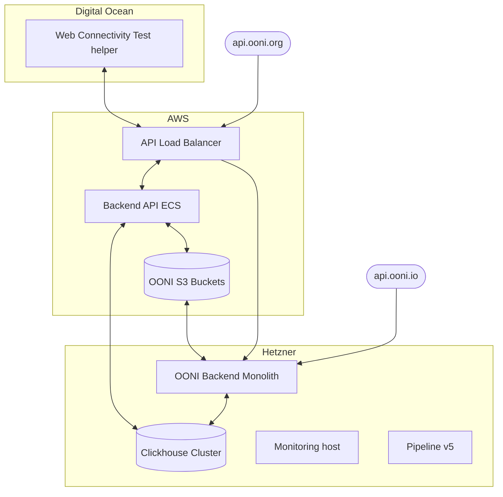

---
# Do not edit! This file is automatically generated
# version: ooni/devops/README.md:0520fe5
title: OONI Devops
description: OONI OONI Devops
slug: devops
sidebar:
    order: 0
---
[edit file](https://github.com/ooni/devops/edit/main/README.md)

At a glance below is the overall architecture of OONI Infrastructure across our various locations:

For more details [Infrastructure docs](https://docs.ooni.org/devops/infrastructure/)
