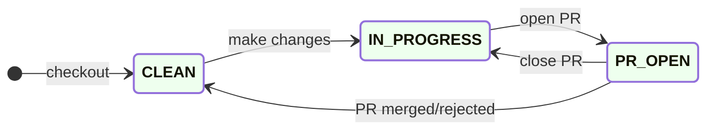
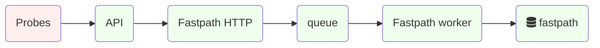
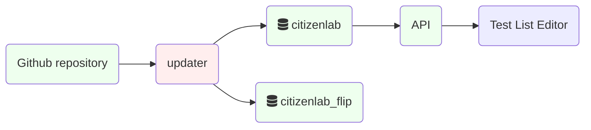
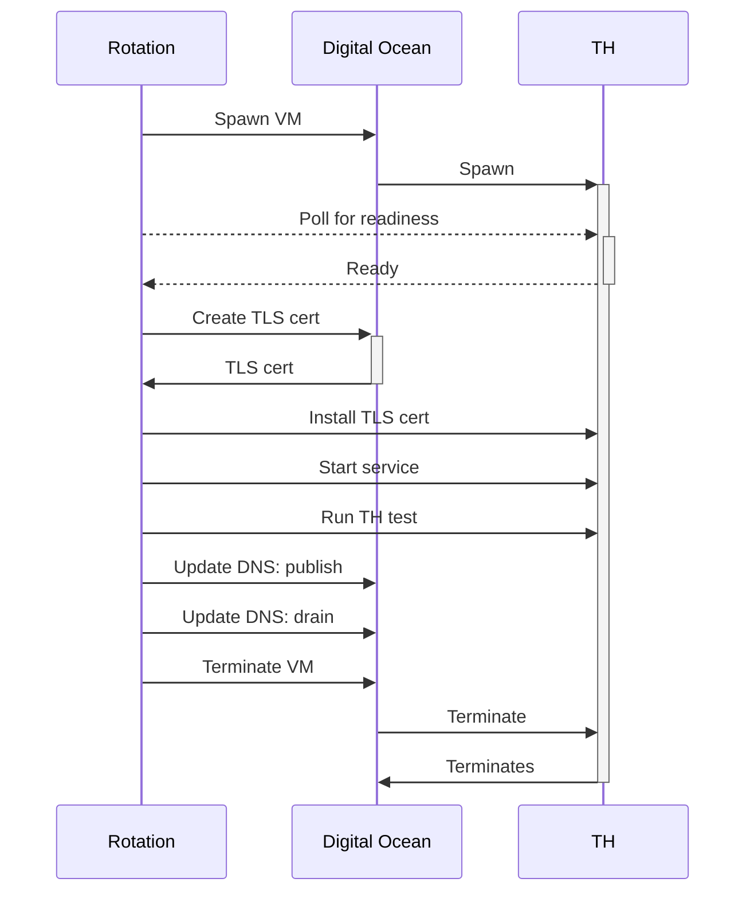
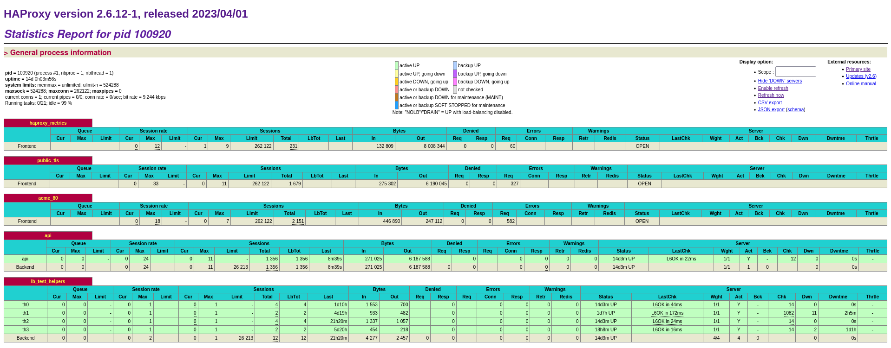
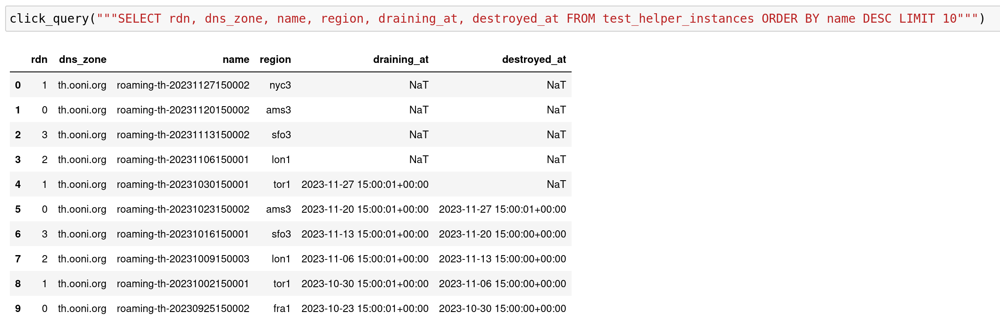
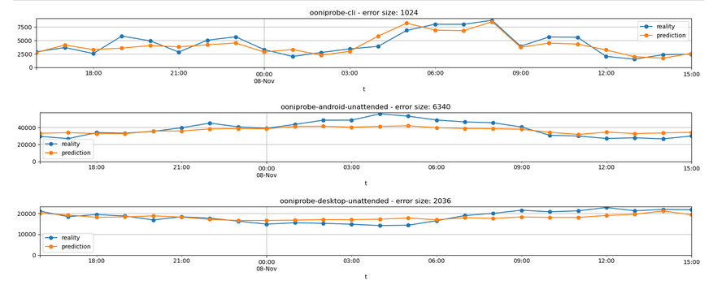

## Systemd timers

Some backend components like the API and Fastpath run as daemons. Many
other run as Systemd timers at various intervals.

The latter approach ensures that a component will start again at the
next time interval even if the previous run crashed out. This provides a
moderate reliability benefit at the expense of having to perform
initialization and shutdown at every run.

To show the existing timers and their next start time run:

```bash
systemctl list-timers
```

### Summary of timers

Here is a summary of the most important timers used in the backend:

    UNIT                           ACTIVATES
    dehydrated.timer               dehydrated.service
    detector.timer                 detector.service
    ooni-api-uploader.timer        ooni-api-uploader.service
    ooni-db-backup.timer           ooni-db-backup.service
    ooni-download-geoip.timer      ooni-download-geoip.service
    ooni-rotation.timer            ooni-rotation.service
    ooni-update-asn-metadata.timer ooni-update-asn-metadata.service
    ooni-update-citizenlab.timer   ooni-update-citizenlab.service
    ooni-update-fingerprints.timer ooni-update-fingerprints.service

Ooni-developed timers have a matching unit file with .service extension.

To show the existing timers and their next start time run:

```bash
systemctl list-timers
```

This can be useful for debugging.

### Dehydrated timer

Runs the Dehydrated ACME tool, see [Dehydrated](#dehydrated)&thinsp;⚙

is a simple script that provides ACME support for Letsencrypt. It's
integrated with Nginx or HaProxy with custom configuration or a small
script as \"glue\".

[Source](https://github.com/ooni/sysadmin/blob/master/ansible/roles/dehydrated/templates/dehydrated.timer)

### Detector timer

Runs the [social media blocking event detector](#social-media-blocking-event-detector)&thinsp;⚙. It is
installed by the [detector package](#detector-package)&thinsp;📦.

### ooni-api-uploader timer

Runs the [Measurement uploader](#measurement-uploader)&thinsp;⚙. It is installed by the
[analysis package](#analysis-package)&thinsp;📦. Runs `/usr/bin/ooni_api_uploader.py`

[Source](https://github.com/ooni/backend/blob/0ec9fba0eb9c4c440dcb7456f2aab529561104ae/api/debian/ooni-api-uploader.timer)

### ooni-db-backup timer

Runs the [Database backup tool](#database-backup-tool)&thinsp;⚙ as
`/usr/bin/ooni-db-backup` Also installed by the
[analysis package](#analysis-package)&thinsp;📦.

[Source](https://github.com/ooni/backend/blob/0ec9fba0eb9c4c440dcb7456f2aab529561104ae/analysis/debian/ooni-db-backup.timer)

### ooni-download-geoip timer

Fetches GeoIP databases, installed by the [ooni-api](#api)&thinsp;⚙. Runs
`/usr/bin/ooni_download_geoip.py`

Monitored with the [GeoIP dashboard](#geoip-mmdb-database-dashboard)&thinsp;📊

See [GeoIP downloader](#geoip-downloader)&thinsp;⚙

[Source](https://github.com/ooni/backend/blob/0ec9fba0eb9c4c440dcb7456f2aab529561104ae/api/debian/ooni-download-geoip.timer)

### ooni-rotation timer

Runs the test helper rotation script, installed by the
[analysis package](#analysis-package)&thinsp;📦. Runs `/usr/bin/rotation`

[Source](https://github.com/ooni/backend/blob/0ec9fba0eb9c4c440dcb7456f2aab529561104ae/analysis/debian/ooni-rotation.timer)

### ooni-update-asn-metadata timer

Fetches [ASN](#asn)&thinsp;💡 metadata, installed by the
[analysis package](#analysis-package)&thinsp;📦. Runs `/usr/bin/analysis --update-asnmeta`

[Source](https://github.com/ooni/backend/blob/0ec9fba0eb9c4c440dcb7456f2aab529561104ae/analysis/debian/ooni-update-asn-metadata.timer)

### ooni-update-citizenlab

Fetches CitizenLab data from GitHub, installed by the
[analysis package](#analysis-package)&thinsp;📦. Runs `/usr/bin/analysis --update-citizenlab`

[Source](https://github.com/ooni/backend/blob/0ec9fba0eb9c4c440dcb7456f2aab529561104ae/analysis/debian/ooni-update-citizenlab.timer)

### ooni-update-fingerprints

Fetches fingerprints from GitHub, installed by the
[analysis package](#analysis-package)&thinsp;📦. Runs `/usr/bin/analysis --update-fingerprints`

[Source](https://github.com/ooni/backend/blob/0ec9fba0eb9c4c440dcb7456f2aab529561104ae/analysis/debian/ooni-update-fingerprints.timer)

## Nettest names

Nettest specifications are kept at
<https://github.com/ooni/spec/tree/master/nettests>

### Web connectivity test

Nettest for HTTP/HTTPS connectivity named `web_connectivity`.
See <https://github.com/ooni/spec/blob/master/nettests/ts-017-web-connectivity.md>

### Signal test

Nettest for [Signal Private Messenger](https://signal.org/) named `signal`
See <https://github.com/ooni/spec/blob/master/nettests/ts-029-signal.md>

## API

The API provides entry points used by the probes,
[Explorer](#ui:explorer) [Test List Editor](#test-list-editor)&thinsp;🖱 and other UIs, and
researchers.

Entry points under `/api/v1/` are meant for public consumption and
versioned. Those under `/api/_/` are for internal use.

The API is versioned. Access is rate limited based on source IP address
and access tokens. See [Rate limiting and quotas](#rate-limiting-and-quotas)&thinsp;🐝 for
details.

due to the computational cost of running heavy queries on the database.
The API entry points are documented at
[apidocs](https://api.ooni.io/apidocs/) using
[flasgger](https://flasgger.pythonanywhere.com/). A swagger JSON
specification is published at <https://api.ooni.io/apispec_1.json>

The file is also tracked at
<https://github.com/ooni/backend/blob/0ec9fba0eb9c4c440dcb7456f2aab529561104ae/api/docs/apispec.json>
It is checked for consistency by CI in the
[API end-to-end test](#api-end-to-end-test)&thinsp;💡, see
<https://github.com/ooni/backend/blob/0ec9fba0eb9c4c440dcb7456f2aab529561104ae/.github/workflows/test_new_api.yml#L27>

To regenerate the spec file when implementing changes to the API use:
<https://github.com/ooni/backend/blob/0ec9fba0eb9c4c440dcb7456f2aab529561104ae/api/tools/check_apispec_changes>

Before diving into the API codebase it's worth glancing at commonly used
functions:

URL parameter parsing utilities at
<https://github.com/ooni/backend/blob/0ec9fba0eb9c4c440dcb7456f2aab529561104ae/api/ooniapi/urlparams.py>

Caching functions `cachedjson` and `nocachejson` at
<https://github.com/ooni/backend/blob/0ec9fba0eb9c4c440dcb7456f2aab529561104ae/api/ooniapi/utils.py#L18>

Various database access functions `query_click`, `insert_click` at
<https://github.com/ooni/backend/blob/0ec9fba0eb9c4c440dcb7456f2aab529561104ae/api/ooniapi/database.py#L73>

API routes are mounted at:
<https://github.com/ooni/backend/blob/0ec9fba0eb9c4c440dcb7456f2aab529561104ae/api/ooniapi/database.py#L73>

Functions related to initialization of the service and configurating
rate limiting:
<https://github.com/ooni/backend/blob/0ec9fba0eb9c4c440dcb7456f2aab529561104ae/api/ooniapi/app.py>

> **note**
> Caching can be a source of bugs: enabling or disabling it explicitly in
> the codebase (instead of relying on defaults in Nginx/HaProxy) improves
> readability.

> **important**
> Various queries are designed to support active/standby or active/active
> database setups. See [Overall design](#overall-design)&thinsp;💡 for details.

### API cache

The API uses cacheing functions provided by [Nginx](#nginx)&thinsp;⚙.

Caching functions `cachedjson` and `nocachejson` are defined at
<https://github.com/ooni/backend/blob/0ec9fba0eb9c4c440dcb7456f2aab529561104ae/api/ooniapi/utils.py#L18>

### ASN

Autonomous System Number, described at
<https://en.wikipedia.org/wiki/Autonomous_system_(Internet>) It is
stored as `probe_asn` in measurements, and as `probe_asn` column in the
[fastpath table](#fastpath-table)&thinsp;⛁. Used as a search term in
[Searching for measurements](#api:list_msmts) and [Aggregation and MAT](#aggregation-and-mat)&thinsp;🐝

The lookup system in the API is updated by the
[ASN metadata updater](#asn-metadata-updater)&thinsp;⚙. See
[ASN metadata updater dashboard](#asn-metadata-updater-dashboard)&thinsp;📊 and [ooni-update-asn-metadata
timer](#timer:asnmeta_updater).

### Geolocation

The API and implements
[geolocation](https://en.wikipedia.org/wiki/Internet_geolocation) in
order to identify the [ASN](#asn)&thinsp;💡

### Auth

This module implements browser authentication and user accounts. See
[Probe services](#probe-services)&thinsp;🐝 for probe authentication.

It is designed to fit the following requirements:

- Never store users email address centrally nor IP addresses nor
  passwords

- Verify email to limit spambots. Do not use CAPCHAs or other 3rd
  party services

- Support multiple sessions and multiple devices, ability to register
  multiple times

- Do not leak the existence of absence of accounts for a given email
  address

Workflow:

- To register the UIs call
  <https://api.ooni.io/apidocs/#/default/post_api_v1_user_register>
  using an email address and the user receives a temporary login link
  by email

- Upon clicking on the link the UIs call
  <https://api.ooni.io/apidocs/#/default/get_api_v1_user_login> and
  receive a long-lived JWT in a cookie

- The UIs call any API entry point sending the JWT cookie

- The UIs call
  <https://api.ooni.io/apidocs/#/default/get_api_v1_user_refresh_token>
  as needed to refresh the JWT

The API als provides entry points to:

- Get account metadata
  <https://api.ooni.io/apidocs/#/default/get_api___account_metadata>

- Get role for an existing account
  <https://api.ooni.io/apidocs/#/default/get_api_v1_get_account_role__email_address_>

- Set account roles
  <https://api.ooni.io/apidocs/#/default/post_api_v1_set_account_role>

- Expunge sessions (see below)
  <https://api.ooni.io/apidocs/#/default/post_api_v1_set_session_expunge>

Browsers sessions can be expunged to require users to log in again. This
can be used if an account role needs to be downgraded or terminated
urgently.

> **important**
> Account IDs are not the same across test and production instances.

This is due to the use of a configuration variable
`ACCOUNT_ID_HASHING_KEY` in the hashing of the email address. The
parameter is read from the API configuration file. The values are
different across deployment stages as a security feature.

Also see [Creating admin API accounts](#creating-admin-api-accounts)&thinsp;📒 for more
details.

[Sources](https://github.com/ooni/backend/blob/0ec9fba0eb9c4c440dcb7456f2aab529561104ae/api/ooniapi/auth.py)

### Measurements

This module primarily provides entry points to access measurements,
typically used by Explorer and sometimes directly by users.

Mounted under `/api/v1/measurement/`

[Sources](https://github.com/ooni/backend/blob/0ec9fba0eb9c4c440dcb7456f2aab529561104ae/api/ooniapi/measurements.py)

#### Searching for measurements

The entry point
<https://api.ooni.io/apidocs/#/default/get_api_v1_measurements> provides
measurement searching and listing.

It is primarily used by <https://explorer.ooni.org/search>

#### Getting measurement bodies

Various API entry points allow accessing measurement bodies. Typically
the lookup is done by `measurement_uid`:

- <https://api.ooni.io/apidocs/#/default/get_api_v1_measurement__measurement_uid_>

- <https://api.ooni.io/apidocs/#/default/get_api_v1_raw_measurement>

- <https://api.ooni.io/apidocs/#/default/get_api_v1_measurement_meta>

For legacy reasons measurements can also be accessed by `report_id` +
`input` instead of `measurement_uid`

> **important**
> Accessing measurements by `report_id` + `input` does not guarantee
> uniqueness.

The lookup process can access measurement bodies from multiple
locations. The lookup is performed in different order for different
measurements based on the likelihood of success:

- Scan the local spool directory
  `/var/lib/ooniapi/measurements/incoming/` for fresh measurements

- Scan other API hosts (if any) for fresh measurements. This is
  required to support active/active backend deployments.

- Lookup the measurement data in [jsonl table](#jsonl-table)&thinsp;⛁ and then
  fetch the required [JSONL files](#jsonl-files)&thinsp;💡 from
  [S3 data bucket](#s3-data-bucket)&thinsp;💡 and extract the content.

##### Performance considerations

Fetching data from the [S3 data bucket](#s3-data-bucket)&thinsp;💡 bucket can be
resource-intensive. However:

- Very recent measurements are likely to be found in the local on-disk
  queue instead of having to fetch them from S3. See
  [Measurement uploader](#measurement-uploader)&thinsp;⚙ for details.

- Frequently accessed measurements benefit from the [API cache](#api-cache)&thinsp;💡.

- Measurement bodies are rarely accessed. The overall amount of
  measurements is too large for users to explore a significant
  fraction through the web UIs.

Possible improvements are:

- Compress JSONL files using <https://github.com/facebook/zstd> with
  high compression rates

- Use a seekable format and store the measurement location in the
  JSONL file in the [jsonl table](#jsonl-table)&thinsp;⛁ expressed in bytes. See
  <https://github.com/facebook/zstd/blob/dev/contrib/seekable_format/README.md>

<https://github.com/ooni/backend/blob/0ec9fba0eb9c4c440dcb7456f2aab529561104ae/api/ooniapi/measurements.py>

#### Measurement feedback

This part of the API is used to collect and serve user feedback on
measurements. It uses [msmt_feedback table](#msmt_feedback-table)&thinsp;⛁ and
provides:

- Getting feedback for an existing measurement
  <https://api.ooni.io/apidocs/#/default/get_api___measurement_feedback__measurement_uid_>

- Submitting new feedback
  <https://api.ooni.io/apidocs/#/default/post_api___measurement_feedback>

All users can access feedbacks but only authenticated ones can submit
their feedbacks.

Users can submit only one feedback for each measurement. When the
submission entry point is called a second time for the same measurements
the previous feedback is overwritten using database row deduplication.

Valid feedback statuses are:

    blocked
    blocked.blockpage
    blocked.blockpage.http
    blocked.blockpage.dns
    blocked.blockpage.server_side
    blocked.blockpage.server_side.captcha
    blocked.dns
    blocked.dns.inconsistent
    blocked.dns.nxdomain
    blocked.tcp
    blocked.tls
    ok
    down
    down.unreachable
    down.misconfigured

[Sources](https://github.com/ooni/backend/blob/0ec9fba0eb9c4c440dcb7456f2aab529561104ae/api/ooniapi/measurements.py)

### Aggregation and MAT

The aggregation API leverages the OLAP features of
[ClickHouse](#clickhouse)&thinsp;⚙ to provide summaries and statistics on
measurements. It is primarily used by the
[MAT](https://explorer.ooni.org/chart/mat). It can also be used to
implement other statistics in Explorer or accessed directly by
researchers to extract data.

[Aggregation entry
point](https://api.ooni.io/apidocs/#/default/get_api_v1_aggregation)

[Sources](https://github.com/ooni/backend/blob/0ec9fba0eb9c4c440dcb7456f2aab529561104ae/api/ooniapi/aggregation.py)

> **important**
> Caching of this entry point should be implemented carefully as new
> measurements are constantly being inserted and old measurements might be
> occasionally reprocessed.

Also see [Aggregation cache monitoring](#aggregation-cache-monitoring)&thinsp;🐍 and
[Investigating heavy aggregation queries runbook](#investigating-heavy-aggregation-queries-runbook)&thinsp;📒.

### Probe services

This part of the API is implemented in the `probe_services.py` module.
It provides entry points that are meant to be used exclusively by
probes.

[Sources](https://github.com/ooni/backend/blob/0ec9fba0eb9c4c440dcb7456f2aab529561104ae/api/ooniapi/probe_services.py)

#### Check-in

This entry point is the preferred way for probes to:

- Geo-resolve their IP address to [ASN](#asn)&thinsp;💡 and network name.
  See

- Receive a list of URLs for [Web connectivity test](#web-connectivity-test)&thinsp;Ⓣ

- Receive a list of test helpers

- Set flags to implement incremental rollouts and A/B testing new
  features

See <https://api.ooni.io/apidocs/#/default/post_api_v1_check_in>

Test lists are prioritized based on the country code and
[ASN](#asn)&thinsp;💡 of the probes, as well as flags indicating if the
probe is connected to WiFi and the battery is being charged.

### Tor targets

Tor targets are served: at path `/api/v1/test-list/tor-targets`. See
<https://api.ooni.io/apidocs/#/default/get_api_v1_test_list_tor_targets>

They are read from a configuration file. The path is set in the main
configuration file under `TOR_TARGETS_CONFFILE`. It usually is
`/etc/ooni/tor_targets.json`.

To make changes in the Tor targets see the runbook
[Updating tor targets](#updating-tor-targets)&thinsp;📒

### Test helpers list

This entry point provides a list of test helpers to the probes:
<https://api.ooni.io/apidocs/#/default/get_api_v1_test_helpers>

> **important**
> Test helpers addresses are served with a load-balancing algorithm. The
> amount requests per second they receive should be consistent across
> hosts, except for `0.th.ooni.org`.

`0.th.ooni.org` is treated differently from other test helpers:
it receives less traffic to allow testing new releases with lower impact.

See
<https://github.com/ooni/backend/blob/86c6c7e1d297fb8361a162f6081e5e138731e492/api/ooniapi/probe_services.py#L480>

#### Miscellaneous probe configuration data

Various endpoints provide data to configure the probe:

- <https://api.ooni.io/apidocs/#/default/get_api_v1_collectors>

- <https://api.ooni.io/apidocs/#/default/get_api_v1_test_list_psiphon_config>

- <https://api.ooni.io/apidocs/#/default/post_bouncer_net_tests>

#### Probe registration and login

Two entry points provide probe registration and login. The mechanism and
the accounts are legacy and completely independent from
[Auth](#auth)&thinsp;🐝.

The workflows follow these steps:

- A new probe registers and receives a `client_id` token using
  <https://api.ooni.io/apidocs/#/default/post_api_v1_register>

- The token is stored permanently on the probe

- The probe calls
  <https://api.ooni.io/apidocs/#/default/post_api_v1_login> when
  needed and receives a temporary token

- The probe calls check-in supplying the temporary token

On [backend-fsn.ooni.org](#backend-fsn.ooni.org)&thinsp;🖥 the two entry points are currently
being redirected to a different host implementing
<https://orchestrate.ooni.io/> while other backend hosts are exposing
the endpoints in the API.

> **important**
> The probe authentication implemented in the API is not backward
> compatible with credentials already generated by Orchestrate and stored
> by existing probes.

#### Measurement submission

The probe services module also provides entry points to submit
measurements. The submission is done in steps:

1.  The probe opens a new report at
    <https://api.ooni.io/apidocs/#/default/post_report>

2.  The probe submit one or more measurements with one HTTP POST each at
    <https://api.ooni.io/apidocs/#/default/post_report__report_id_>

3.  The probe optionally closes the report using
    <https://api.ooni.io/apidocs/#/default/post_report>*report_id*close
    Closing reports is currently unnecessary.

#### Robots.txt

Probe services also serve the `robots.txt` file at
<https://api.ooni.io/robots.txt>
<https://api.ooni.io/apidocs/#/default/get_robots_txt>

This is use to block or throttle search engines and other bots that in
the past caused significant load on the API.

> **note**
> some aggressive bots might ignore `robots.txt`. See
> [Limiting scraping](#limiting-scraping)&thinsp;📒

<https://api.ooni.io/apidocs/#/default/get_stats>

#### Incident management

The incident management module implements ways for users to create,
update and list incidents.

Related:
<https://docs.google.com/document/d/1TdMBWD45j3bx7GRMIriMvey72viQeKrx7Ad6DyboLwg/>

Accounts with \"admin\" role can perform the same actions as regolar
users and additionally can publish, unpublish and delete incidents.

All the routes related to this module are mounted under
`/api/v1/incidents/`:

- Search and list incidents:
  <https://api.ooni.io/apidocs/#/default/get_api_v1_incidents_search>

- Show an incident:
  <https://api.ooni.io/apidocs/#/default/get_api_v1_incidents_show__incident_id_>

- Create or update an incident:
  <https://api.ooni.io/apidocs/#/default/post_api_v1_incidents__action_>
  Search/list incidents with:

- Filtering by domain/cc/asn/creator id/ and so on

- Sort by creation/edit date, event date, and so on

Users can only update/delete incidents created by themselves. Admins can
update/delete everything.

Incidents are stored in the [incidents table](#incidents-table)&thinsp;⛁

See
[Sources](https://github.com/ooni/backend/blob/0ec9fba0eb9c4c440dcb7456f2aab529561104ae/api/ooniapi/incidents.py)

#### Prioritization

This module implements reactive prioritization for URLs in the test list
served to the probes.

`/api/v1/check-in` and `/api/v1/test-list/urls` provide dynamic URL
tests lists for [Web connectivity test](#web-connectivity-test)&thinsp;Ⓣ based on the
CitizenLab URL list and the measurements count from the last 7 days.

The `prio.py` module is used mainly by the [Probe services](#probe-services)&thinsp;🐝 API
and secondarily by the `private_api_check_in` method in the
[Private entry points](#private-entry-points)&thinsp;🐝.

For changing prioritization rules see
[Prioritization rules UI](#ui:priomgm) and [Prioritization management](#prioritization-management)&thinsp;🐝


<!--
blockdiag {
 default_shape = roundedbox;
 "Probes" [color = "#ffeeee"];
 "fastpath table" [shape = ellipse, href = "@@counters_asn_test_list-table"];
 "url_priorities table" [shape = ellipse, href = "@@url_priorities-table"];
 "counters_asn_test_list" [shape = ellipse, href = "@@counters_asn_test_list-table"];
 "API: receive msmt" [color = "#eeeeff"];
 "Fastpath" [color = "#eeeeff", href = "@@fastpath"];
 "API: prio" [color = "#eeeeff"];
 Probes -> "API: receive msmt" [label = "POST"];
 "API: receive msmt" -> "Fastpath" [label = "POST"];
 "Fastpath" -> "fastpath table" [label = "INSERT"];
 "fastpath table" -> "counters_asn_test_list" [label = "auto"];
 "counters_asn_test_list" -> "API: prio" [label = "SELECT"];
 "API: prio" -> "Probes" [label = "check-in"];
}
-->

Ellipses represent data; rectangles represent processes. Purple
components belong to the backend. Click on the image and then click on
each shape to see related documentation.

In the diagram arrows show information flow.

The prioritization system implements a feedback mechanism to provide
efficient coverage of URLs in [Web connectivity test](#web-connectivity-test)&thinsp;Ⓣ in
[ASN](#asn)&thinsp;💡 with low coverage.

Measurements from probes are received by the [API](#api)&thinsp;⚙, sent to
the [Fastpath](#fastpath)&thinsp;⚙ and then stored in the
[fastpath table](#tbl:fastpath). [ClickHouse](#clickhouse)&thinsp;⚙ automatically
updates the [counters_asn_test_list table](#counters_asn_test_list-table)&thinsp;⛁
in real time. See the link for details on the table contents.

Later on probes call API entry points like
<https://api.ooni.io/apidocs/#/default/post_api_v1_check_in> and receive
new URLs (inputs) for [Web connectivity test](#web-connectivity-test)&thinsp;Ⓣ. The URLs
are ordered according to the priorities set in the
[url_priorities table](#url_priorities-table)&thinsp;⛁ and the amount of measurements gathered in
the past days from probes in the same [ASN](#asn)&thinsp;💡.

[prio.py
sources](https://github.com/ooni/backend/blob/0ec9fba0eb9c4c440dcb7456f2aab529561104ae/api/ooniapi/prio.py)

[private API
sources](https://github.com/ooni/backend/blob/0ec9fba0eb9c4c440dcb7456f2aab529561104ae/api/ooniapi/private.py)

[probe services
sources](https://github.com/ooni/backend/blob/0ec9fba0eb9c4c440dcb7456f2aab529561104ae/api/ooniapi/probe_services.py)

For debugging see
<https://api.ooni.io/apidocs/#/default/get_api___debug_prioritization>
and [Test list prioritization monitoring](#test-list-prioritization-monitoring)&thinsp;🐍

#### Priorities and weights

URLs have priorities based on the rules from the
[url_priorities table](#url_priorities-table)&thinsp;⛁.

Prioritization rules can be viewed and edited by accounts with `admin`
rights on <https://test-lists.ooni.org/prioritization>

The
[compute_priorities](https://github.com/ooni/backend/blob/0ec9fba0eb9c4c440dcb7456f2aab529561104ae/api/ooniapi/prio.py#L102)
function calculates priority and weight for each supplied URL.

Priorities are calculated by matching all the prioritization rules to
each URL in the [citizenlab table](#citizenlab-table)&thinsp;⛁. They do not depend
on the amount of past measurements.

Priorities values are relative, e.g. if one URL has a priority of 800
and another one has 200 the first should be measured 4 times more often
than the latter.

The URLs sent to the probes are ordered from the most urgent to the
least urgent by calculating weights as `priority / measurement count`.
This is done with a granularity of a single country code +
[ASN](#asn)&thinsp;💡 pair.

Probes start performing [Web connectivity test](#web-connectivity-test)&thinsp;Ⓣ from the
top of the list.

You can inspect generated priorities with the
[Priorities and weights notebook](#priorities-and-weights-notebook)&thinsp;📔 or using the API at
<https://api.ooni.io/apidocs/>_/default/get_api_v1_test_list_urls or
<https://api.ooni.io/apidocs/>_/default/get_api\_\_\_debug_prioritization
e.g.:

    $ curl -s 'https://api.ooni.io/api/v1/test-list/urls?country_code=IT&probe_asn=3269&debug=True' | jq -S | less

    $ curl -s 'https://ams-pg-test.ooni.org/api/_/debug_prioritization?probe_cc=IT&probe_asn=3269&limit=9999' | jq -S | less

### Private entry points

The `private.py` module provides many entry points not meant for public
consumption. They are not versioned, mounted under `/api/_` and used
exclusively by:

- [Explorer](#explorer)&thinsp;🖱

- [Test List Editor](#test-list-editor)&thinsp;🖱

Statistics and summaries, mainly for Explorer:

- <https://api.ooni.io/apidocs/#/default/get_api___asn_by_month>

- <https://api.ooni.io/apidocs/#/default/get_api___circumvention_runtime_stats>

- <https://api.ooni.io/apidocs/#/default/get_api___circumvention_stats_by_country>

- <https://api.ooni.io/apidocs/#/default/get_api___countries>

- <https://api.ooni.io/apidocs/#/default/get_api___countries_by_month>

- <https://api.ooni.io/apidocs/#/default/get_api___country_overview>

- <https://api.ooni.io/apidocs/#/default/get_api___domain_metadata>

- <https://api.ooni.io/apidocs/#/default/get_api___domains>

- <https://api.ooni.io/apidocs/#/default/get_api___global_overview>

- <https://api.ooni.io/apidocs/#/default/get_api___global_overview_by_month>

- <https://api.ooni.io/apidocs/#/default/get_api___im_networks>

- <https://api.ooni.io/apidocs/#/default/get_api___im_stats>

- <https://api.ooni.io/apidocs/#/default/get_api___network_stats>

- <https://api.ooni.io/apidocs/#/default/get_api___networks>

- <https://api.ooni.io/apidocs/#/default/get_api___test_coverage>

- <https://api.ooni.io/apidocs/#/default/get_api___test_names>

- <https://api.ooni.io/apidocs/#/default/get_api___vanilla_tor_stats>

- <https://api.ooni.io/apidocs/#/default/get_api___website_networks>

- <https://api.ooni.io/apidocs/#/default/get_api___website_stats>

- <https://api.ooni.io/apidocs/#/default/get_api___website_urls>

Misc functions:

- [ASN](#asn)&thinsp;💡 metadata
  <https://api.ooni.io/apidocs/#/default/get_api___asnmeta>

- Check uploaded reports
  <https://api.ooni.io/apidocs/#/default/get_api___check_report_id>

For debugging:
<https://api.ooni.io/apidocs/#/default/get_api___quotas_summary> See
[Rate limiting and quotas](#rate-limiting-and-quotas)&thinsp;🐝 for details.

> **note**
> There are other entry points under `/api/_` that are not part of this
> module, e.g. [OONI Run](#ooni-run)&thinsp;🐝

[Sources](https://github.com/ooni/backend/blob/0ec9fba0eb9c4c440dcb7456f2aab529561104ae/api/ooniapi/private.py)

### Rate limiting and quotas

The API is provided with rate limiting functions and traffic quotas to
provide fair use and protect the database from overloading. It was
initially implemented to protect PostgreSQL used in the past.

The rate limiting is based on multiple usages quotas with monthly,
weekly and daily limits. The limit are applied to `/24` subnets where
HTTP connections are coming from by default, or with a token system for
authenticated accounts. Quotas are stored in
[LMDB](http://www.lmdb.tech/doc/) in order to track the values
consistently across API processes with minimal increase in CPU and I/O
load.

Resource usage can vary widely between different API entry points and
query parameters. In order to account resource consumption both in terms
of CPU and disk I/O quotas are consumed based on the wallclock time
taken to to process each API call. This means that i.e. an API call that
takes 2 seconds consumes 20 times more quota than a call that takes 100
ms.

When any of the monthly, weekly and daily quotas are exceeded users
receive HTTP 429 (Too Many Requests) until quotas are incremented again.
Increments happen every hour.

There's an API call to get a summary of used quotas:
<https://api.ooni.io/api/_/quotas_summary>
See [Investigating heavy aggregation queries runbook](#investigating-heavy-aggregation-queries-runbook)&thinsp;📒 for usage examples.

Configuration for rate limiting is at:
<https://github.com/ooni/backend/blob/0ec9fba0eb9c4c440dcb7456f2aab529561104ae/api/ooniapi/app.py>

[Sources](https://github.com/ooni/backend/blob/0ec9fba0eb9c4c440dcb7456f2aab529561104ae/api/ooniapi/rate_limit_quotas.py)

### OONI Run

This module implements management of OONI Run links.

All the routes related to this module are mounted under
`/api/v1/ooni_run/`:

- List OONIRun descriptors
  <https://api.ooni.io/apidocs/#/default/get_api___ooni_run_list>

- Archive an OONIRun descriptor and all its past versions
  <https://api.ooni.io/apidocs/#/default/post_api>\**ooni_run_archive*ooni_run_link_id\*

- Create a new oonirun link or a new version for an existing one
  <https://api.ooni.io/apidocs/#/default/post_api___ooni_run_create>

- Fetch OONIRun descriptor by creation time or the newest one
  <https://api.ooni.io/apidocs/#/default/get_api>\**ooni_run_fetch*ooni_run_link_id\*

Specifications are published at:
<https://github.com/ooni/spec/blob/master/backends/bk-005-ooni-run-v2.md>

OONI Run links can be updated by sending new translations and new
versions. Each entry is stored as a new database row. The creation entry
point detects if the new submission contains only translation changes.
In that case it only updates `translation_creation_time`. Otherwise it
also updates `descriptor_creation_time`. The two values are then used by
the probe to access either the latest translation for a given
`descriptor_creation_time`, or the latest version overall.

[Sources](https://github.com/ooni/backend/blob/0ec9fba0eb9c4c440dcb7456f2aab529561104ae/api/ooniapi/oonirun.py)

### CitizenLab

The `citizenlab.py` module contains entry points related to managing
both the [CitizenLab Test List](#citizenlab-test-list)&thinsp;💡 and
[Prioritization management](#prioritization-management)&thinsp;🐝.

This subchapter describes the first part.

The following entry points allow authenticated users to propose changes
to the CitizenLab repository. It is a private API used by
[Test List Editor](#test-list-editor)&thinsp;🖱. The API manages an internal clone of the CitizenLab
repository for each user that goes through the workflow.

Entry points:

- Fetch Citizenlab URL list and additional metadata
  <https://api.ooni.io/apidocs/#/default/get_api___url_submission_test_list__country_code_>

- Create/update/delete a CitizenLab URL entry. Changes are stored in a
  temporary git repository in the API
  <https://api.ooni.io/apidocs/#/default/post_api_v1_url_submission_update_url>

- Submit changes by opening a pull request on the CitizenLab
  repository
  <https://api.ooni.io/apidocs/#/default/post_api_v1_url_submission_submit>

The repository goes through the following state machine:



Description of the states:

- ● - the local repository does not exist yet

- CLEAN - the local repository has no changes and it is in sync with
  the CitizenLab public repository

- IN_PROGRESS - there are some changes in the working tree but they
  have not been pushed to the public repository's pull request branch

- PR_OPEN - a pull request is open

Users can open a pull request and close it to make further changes. The
\"PR merged/rejected\" edge in the state machine diagram the only
transition that is not started by the user.

See [CitizenLab test list updater](#citizenlab-test-list-updater)&thinsp;⚙
for a description of the data flow.

[Sources](https://github.com/ooni/backend/blob/0ec9fba0eb9c4c440dcb7456f2aab529561104ae/api/ooniapi/citizenlab.py)

See [Metrics list](#metrics-list)&thinsp;💡 for application metrics.

### Prioritization management

This part of the API is used by the OONI team to manage prioritization
rules for URLs used by [Web connectivity test](#web-connectivity-test)&thinsp;Ⓣ. It lives
in the `citizenlab.py` module.

The UI is at <https://test-lists.ooni.org/prioritization> and it is part
of the [Test List Editor](#test-list-editor)&thinsp;🖱. It is available to accounts with
`admin` role only.

See [Prioritization](#prioritization)&thinsp;🐝 for the prioritization rules logic.

There are two entry points:

- List URL priority rules
  <https://api.ooni.io/apidocs/#/default/get_api___url_priorities_list>

- Add/update/delete an URL priority rule
  <https://api.ooni.io/apidocs/#/default/post_api___url_priorities_update>

The changes are immediately applied to the
[url_priorities table](#tbl:url_priorities) and used by [Prioritization](#prioritization)&thinsp;🐝.

## Public and private web UIs

### Explorer

UI to display measurements and aggregated data to the users
<https://explorer.ooni.org/>

Fetches data from the [API](#api)&thinsp;⚙

### CitizenLab Test List

A list of URLs for [Web connectivity test](#web-connectivity-test)&thinsp;Ⓣ managed by
the [CitizenLab project](https://citizenlab.ca/).

The repository lives at <https://github.com/citizenlab/test-lists>

It is fetched automatically by the
[CitizenLab test list updater](#citizenlab-test-list-updater)&thinsp;⚙.

### Test List Editor

UI to allow authenticated users to submit or edit URLs in the CitizenLab
Test List <https://test-lists.ooni.org/>

Documented at <https://ooni.org/support/github-test-lists/>

Fetches data from the [CitizenLab](#citizenlab)&thinsp;🐝 API.

### Prioritization rules UI

UI for internal use to manage prioritization rules. It is available at
<https://test-lists.ooni.org/prioritization> and it is part of the
[Test List Editor](#test-list-editor)&thinsp;🖱.

See [Prioritization management](#prioritization-management)&thinsp;🐝 for details.

## Fastpath

The fastpath is a data processing pipeline designed to process incoming
measurements in real time.

It also supports processing old measurements by fetching them from the
[S3 data bucket](#s3-data-bucket)&thinsp;💡.

- Generate scoring metadata and flag them as `confirmed`, `anomaly` as
  needed.

- Detect invalid measurements (e.g. from the future) and flag them as
  `failed`.

- Extract metadata from measurements e.g. `engine_version`

- Write scoring and metadata to the [fastpath table](#fastpath-table)&thinsp;⛁

- Extract OpenVPN observations into [obs_openvpn table](#obs_openvpn-table)&thinsp;⛁

Data flow diagram:




<!--
blockdiag {
 default_shape = roundedbox;
 "S3 jsonl" [shape = ellipse];
 "S3 postcans" [shape = ellipse];
 "disk queue" [shape = ellipse];
 "jsonl table" [shape = ellipse];
 Probes [numbered = 1];
 API [numbered = 2, href = "@@api"];
 uploader [numbered = 3, href = "@@haproxy"];
 Probes -> API -> "disk queue" -> uploader -> "S3 jsonl";
 uploader -> "S3 postcans";
 uploader -> "jsonl table";

 Probes [color = "#ffeeee"];
}
-->

Ellipses represent data; rectangles represent processes. Click on the
image and then click on each shape to see related documentation.

The fastpath has been designed around a set of goals:

- Resiliency: the processing pipeline is lenient towards measurements
  with missing or incorrect fields to mitigate the impact of known and
  unknown bugs in the incoming measurements. Also it is designed to
  minimize the risk of crashing out, blocking or deadlocking.
  Ancillary data sources e.g.
  [Fingerprint updater](#fingerprint-updater)&thinsp;⚙ have failure modes that do not
  block the fastpath.

- Horizontal scalability: Measurement processing is stateless and
  supports lockless multiprocessing. Measurement collection, spooling
  and processing can scale horizontally on multiple hosts.

- Security: measurements are received from a public API and treated as
  untrusted input. All backend components are built on a secure SBOM
  and are sandboxed using minimum privileges.

- Maintainability: all data flows in one direction from the API
  through a simple queue system to the database. The only information
  flowing in the opposite direction is backpressure to prevent
  stalling or unbounded RAM usage when the CPUs are saturated. The
  code style favors simplicity and readability over speed and feature
  richness.

- Support unit, functional, end-to-end integration testing, CI/CD.

### Core logic

Python module:
<https://github.com/ooni/backend/blob/0ec9fba0eb9c4c440dcb7456f2aab529561104ae/fastpath/fastpath/core.py>

Implement the main logic:

- Parse CLI options and configuration files and manage local
  directories.

- Fetch and prepare HTTP and DNS fingerprints from the
  [fingerprints_dns table](#fingerprints_dns-table)&thinsp;⛁ and
  [fingerprints_http table](#fingerprints_http-table)&thinsp;⛁. See
  [Fingerprint updater](#fingerprint-updater)&thinsp;⚙.

- Spawn a local HTTP server to receive fresh measurements from the
  API. See `localhttpfeeder.py`

- Spawn and manage a worker pool to scale out horizontally on
  available CPU cores.

- Alternatively, feed measurements from the [S3 data bucket](#s3-data-bucket)&thinsp;💡.

- Process incoming measurements, see the `process_measurement`
  function.

- Score each measurement individually, see the `score_measurement`
  function. The scoring functions e.g. `score_measurement_telegram`
  are meant to focus only on test-specific data, be stateless and
  unit-testable in isolation.

- Generate anomaly, confirmed and failure flag consistently with
  [Explorer](#explorer)&thinsp;🖱 and the batch pipeline used before.

- Extract metadata and upsert each measurement into
  [fastpath table](#fastpath-table)&thinsp;⛁ in `clickhouse_upsert_summary`

The fastpath also supports buffering writes into large batches to avoid
single-record insert queries in ClickHouse. This provides a 25x speedup
when [Reprocessing measurements](#reprocessing-measurements)&thinsp;📒 from
[S3 data bucket](#s3-data-bucket)&thinsp;💡.

This is not meant to be used for real-time measurement scoring as it
would create risk of losing multiple records in case of failed query,
crash, etc and also increase latency.

> **note**
> Batching writes can also be implemented in ClickHouse using
> [Buffer Table Engine](https://clickhouse.com/docs/en/engines/table-engines/special/buffer)
> or
> [async insert](https://clickhouse.com/docs/en/optimize/asynchronous-inserts)

### Database module

Python module:
<https://github.com/ooni/backend/blob/0ec9fba0eb9c4c440dcb7456f2aab529561104ae/fastpath/fastpath/db.py>

Implements all the database-related functions. The rest of the codebase
is database-agnostic.

> **note**
> Upserts are based on the MergeTree table engine, see
> [Overall design](#overall-design)&thinsp;💡.

### S3 Feeder

Python module:
<https://github.com/ooni/backend/blob/0ec9fba0eb9c4c440dcb7456f2aab529561104ae/fastpath/fastpath/s3feeder.py>

Implements the fetching of measurements from
[S3 data bucket](#s3-data-bucket)&thinsp;💡. The rest of the codebase is agnostic of S3.

It supports new and legacy cans and JSON and YAML formats.

See [Feed fastpath from JSONL](#feed-fastpath-from-jsonl)&thinsp;🐞

### YAML normalization

Python module:
<https://github.com/ooni/backend/blob/0ec9fba0eb9c4c440dcb7456f2aab529561104ae/fastpath/fastpath/normalize.py>

Transforms legacy measurement format in YAML into JSON. YAML form is
legacy and not used for new measurements.

## Test helpers

Test helpers are hosts that provide the test helper `oohelperd` service
to probes. They are deployed by
[Test helper rotation](#test-helper-rotation)&thinsp;⚙ and tracked in
[test_helper_instances table](#test_helper_instances-table)&thinsp;⛁.

They have names and DNS entries `<number>.th.ooni.org`. See
[Test helper rotation](#test-helper-rotation)&thinsp;⚙ for details on the deployment
process.

Test helpers send metrics to [Prometheus](#prometheus)&thinsp;🔧 and send
logs to [monitoring.ooni.org](#monitoring.ooni.org)&thinsp;🖥.

See [Test helpers dashboard](#test-helpers-dashboard)&thinsp;📊 for metrics and
alarming and [Test helpers failure runbook](#test-helpers-failure-runbook)&thinsp;📒 for
troubleshooting.

The address of the test helpers are provided to the probes by the API in
[Test helpers list](#test-helpers-list)&thinsp;🐝.
`0.th.ooni.org` is treated differently from other test helpers.

### Analysis

Miscellaneous scripts, services and tools. It contains ancillary
components that are not updated often and might not justify a dedicated
Debian package for each of them.

Deployed using the [analysis package](#analysis-package)&thinsp;📦

<https://github.com/ooni/backend/blob/0ec9fba0eb9c4c440dcb7456f2aab529561104ae/analysis/>

Data flows from various updaters:


<!--
blockdiag {
 default_shape = roundedbox;
 "ASN repo" -> "ASN updater" -> "asnmeta table" -> API;
 "ASN repo" [shape = ellipse];
 "GeoIP repo" -> "GeoIP downloader" -> "/var/lib/ooniapi" -> API;
 "GeoIP repo" [shape = ellipse];
 "CitizenLab repo" -> "CitizenLab updater" -> "CitizenLab table" -> API;
 "CitizenLab repo" [shape = ellipse];
 "CitizenLab table" [shape = ellipse, href = "@@citizenlab-table"];
 "DNS fingerp. tbl" [shape = ellipse, href = "@@fingerprints_dns-table"];
 "Fastpath" [href = "@@fastpath"];
 "Fingerprints repo" -> "Fingerprints updater" -> "DNS fingerp. tbl" -> Fastpath;
 "Fingerprints repo" -> "Fingerprints updater" -> "HTTP fingerp. tbl" -> Fastpath;
 "Fingerprints repo" [shape = ellipse];
 "HTTP fingerp. tbl" [shape = ellipse, href = "@@fingerprints_http-table"];
 "asnmeta table" [shape = ellipse, href = "@@asnmeta-table"];
 "Fingerprints updater" [color = "#eeeeff"];
 "CitizenLab updater" [color = "#eeeeff"];
 "ASN updater" [color = "#eeeeff"];
 "GeoIP downloader" [color = "#eeeeff"];
 "API" [color = "#eeeeff", href = "@@api"];
 "Fastpath" [color = "#eeeeff", href = "@@fastpath"];
}
-->

Ellipses represent data; rectangles represent processes. Purple
components belong to the backend. Click on the image and then click on
each shape to see related documentation.

See the following subchapters for details:

#### CitizenLab test list updater

This component fetches the test lists from
[CitizenLab Test List](#citizenlab-test-list)&thinsp;💡 and populates the
[citizenlab table](#citizenlab-table)&thinsp;⛁ and
[citizenlab_flip table](#citizenlab_flip-table)&thinsp;⛁.



The git repository <https://github.com/citizenlab/test-lists.git> is
cloned as an unauthenticated user.

Database writes are performed as the `citizenlab` user.

The tables have few constraints on the database side: most of the
validation is done in the script and it is meant to be strict. The
updater overwrites [citizenlab_flip table](#citizenlab_flip-table)&thinsp;⛁ and
then swaps it with [citizenlab table](#citizenlab-table)&thinsp;⛁ atomically. In
case of failure during git cloning, verification and table overwrite the
final swap does not happen, leaving the `citizenlab` table unaltered.

It is deployed using the [analysis package](#analysis-package)&thinsp;📦 and started
by the [ooni-update-citizenlab](#ooni-update-citizenlab)&thinsp;⏲ Systemd timer.

Logs are generated as the `analysis.citizenlab_test_lists_updater` unit.

Also it generates the following metrics with the
`citizenlab_test_lists_updater` prefix:

| Metric name                | Type  | Description     |
| -------------------------- | ----- | --------------- |
| `fetch_citizen_lab_lists`  | timer | Fetch duration  |
| `update_citizenlab_table`  | timer | Update duration |
| `citizenlab_test_list_len` | gauge | Table size      |

The updater lives in one file:
<https://github.com/ooni/backend/blob/0ec9fba0eb9c4c440dcb7456f2aab529561104ae/analysis/analysis/citizenlab_test_lists_updater.py>

To run the updater manually during development:

    PYTHONPATH=analysis ./run_analysis --update-citizenlab --dry-run --stdout

#### Fingerprint updater

This component fetches measurement fingerprints as CSV files from
<https://github.com/ooni/blocking-fingerprints> and populates
[fingerprints_dns table](#fingerprints_dns-table)&thinsp;⛁,
[fingerprints_dns_tmp table](#fingerprints_dns_tmp-table)&thinsp;⛁,
[fingerprints_http table](#fingerprints_http-table)&thinsp;⛁ and
[fingerprints_http_tmp table](#fingerprints_http_tmp-table)&thinsp;⛁.

The tables without `_tmp` are used by the [Fastpath](#fastpath)&thinsp;⚙.

The CSV files are fetched directly without git-cloning.

Database writes are performed as the `api` user, configured in
<https://github.com/ooni/backend/blob/0ec9fba0eb9c4c440dcb7456f2aab529561104ae/analysis/analysis/analysis.py#L64>

The tables have no constraints on the database side and basic validation
is performed by the script:
<https://github.com/ooni/backend/blob/0ec9fba0eb9c4c440dcb7456f2aab529561104ae/analysis/analysis/fingerprints_updater.py#L91>

The updater overwrites the tables ending with `_tmp` and then swaps them
with the \"real\" tables atomically. In case of failure the final swap
does not happen, leaving the \"real\" tables unaltered.

It is deployed using the [analysis package](#analysis-package)&thinsp;📦 and started
by the [ooni-update-citizenlab](#ooni-update-citizenlab)&thinsp;⏲ Systemd timer.

Logs are generated as the `analysis.fingerprints_updater` unit.

Also it generates the following metrics with the `fingerprints_updater`
prefix:

| Metric name                    | Type  | Description        |
| ------------------------------ | ----- | ------------------ |
| `fetch_csv`                    | timer | CSV fetch duration |
| `fingerprints_update_progress` | gauge | Update progress    |
| `fingerprints_dns_tmp_len`     | gauge | DNS table size     |
| `fingerprints_http_tmp_len`    | gauge | HTTP table size    |

See the [Fingerprint updater dashboard](#fingerprint-updater-dashboard)&thinsp;📊 on Grafana.

The updater lives primarily in
<https://github.com/ooni/backend/blob/0ec9fba0eb9c4c440dcb7456f2aab529561104ae/analysis/analysis/fingerprints_updater.py>
and it's called by the `analysis.py` script

To run the updater manually during development:

    PYTHONPATH=analysis ./run_analysis --update-citizenlab --dry-run --stdout

#### ASN metadata updater

This component fetches ASN metadata from
<https://archive.org/download/ip2country-as> (generated via:
<https://github.com/ooni/historical-geoip>)

It populates the [asnmeta table](#asnmeta-table)&thinsp;⛁ and
[asnmeta_tmp table](#asnmeta_tmp-table)&thinsp;⛁.

[asnmeta table](#tbl:asnmeta) is used by the private [API](#api)&thinsp;⚙,
see:
<https://github.com/ooni/backend/blob/0ec9fba0eb9c4c440dcb7456f2aab529561104ae/api/ooniapi/private.py#L923>
and <https://api.ooni.io/apidocs/#/default/get_api___asnmeta>

Database writes are performed as the `api` user, configured in
<https://github.com/ooni/backend/blob/0ec9fba0eb9c4c440dcb7456f2aab529561104ae/analysis/analysis/analysis.py#L64>

The table has no constraints on the database side and basic validation
is performed by the script:
<https://github.com/ooni/backend/blob/0ec9fba0eb9c4c440dcb7456f2aab529561104ae/analysis/analysis/asnmeta_updater.py#L95>

Logs are generated as the `analysis.asnmeta_updater` unit.

Also it generates the following metrics with the `asnmeta_updater`
prefix:

| Metric name               | Type  | Description         |
| ------------------------- | ----- | ------------------- |
| `fetch_data`              | timer | Data fetch duration |
| `asnmeta_update_progress` | gauge | Update progress     |
| `asnmeta_tmp_len`         | gauge | table size          |

See the [ASN metadata updater dashboard](#asn-metadata-updater-dashboard)&thinsp;📊 on
Grafana.

To run the updater manually during development:

    PYTHONPATH=analysis ./run_analysis --update-asnmeta --stdout

#### GeoIP downloader

Fetches GeoIP databases, installed by the [ooni-api](#api)&thinsp;⚙. Started
by the [ooni-download-geoip timer](#ooni-download-geoip-timer)&thinsp;⏲ on
[backend-fsn.ooni.org](#backend-fsn.ooni.org)&thinsp;🖥, see.

Lives at
<https://github.com/ooni/backend/blob/0ec9fba0eb9c4c440dcb7456f2aab529561104ae/>
<https://github.com/ooni/backend/blob/0ec9fba0eb9c4c440dcb7456f2aab529561104ae/api/debian/ooni_download_geoip.py>

Updates `asn.mmdb` and `cc.mmdb` in `/var/lib/ooniapi/`

Can be monitored with the [GeoIP MMDB database dashboard](#geoip-mmdb-database-dashboard)&thinsp;📊
and by running:

    sudo journalctl --identifier ooni_download_geoip

#### Database backup tool

The backup tool is a service that regularly backs up
[ClickHouse](#clickhouse)&thinsp;⚙ tables to S3. It also exports tables in
`CSV.zstd` format for public consumption.

Contrarily to similar tools, it is designed to:

- extract data in chunks and upload it without creating temporary
  files

- without requiring transaction support in the database (not available
  in ClickHouse)

- without requiring transactional filesystems or interrupting the
  database workload

It is configured by [Ansible](#ansible)&thinsp;🔧 using the
`/etc/ooni/db-backup.conf` file. Runs as a SystemD service, see
[ooni-db-backup timer](#ooni-db-backup-timer)&thinsp;⏲

It compresses data using <https://facebook.github.io/zstd/> during the
upload.

The tool chunks tables as needed and add sleeps as needed to prevent a
query backlog impacting the database performance.

Logs are generated as the `ooni-db-backup` unit.

Also it generates the following metrics with the `db-backup` prefix:

| Metric name                      | Type  | Description          |
| -------------------------------- | ----- | -------------------- |
| `upload_to_s3`                   | timer | Data upload duration |
| `run_export`                     | timer | Data export duration |
| `table_{tblname}_backup_time_ms` | timer | Table backup time    |

See the [Database backup dashboard](#database-backup-dashboard)&thinsp;📊 on Grafana and
[Metrics list](#metrics-list)&thinsp;💡 for application metrics.

Monitor with:

    sudo journalctl -f --identifier ooni-db-backup

Future improvements:

- [private/public backups](https://github.com/ooni/backend/issues/766)

- [safer table backup workflow](https://github.com/ooni/backend/issues/767)

- [database schema backup](https://github.com/ooni/backend/issues/765).
  For extracting the schema see [Database schema check](#database-schema-check)&thinsp;💡

#### Ancillary modules

`analysis/analysis/analysis.py` is the main analysis script and acts as
a wrapper to other components.

`analysis/analysis/metrics.py` is a tiny wrapper for the Statsd Python
library.

### Social media blocking event detector

Blocking event detector currently under development. Documented in
<https://docs.google.com/document/d/1WQ6_ybnPbO_W6Tq-xKuHQslG1dSPr4jUbZ3jQLaMqdw/edit>

Deployed by the [detector package](#detector-package)&thinsp;📦.

See [Monitor blocking event detections notebook](#monitor-blocking-event-detections-notebook)&thinsp;📔
[Event detector dashboard](#dash:detector) [Detector timer](#detector-timer)&thinsp;⏲

### OONI bridges

OONI bridges are a new design for handling the connectivity between
Probes and the backend components.

The provide a set of benefits compared to the previous architecture:

- Circumvention: the entry point for the API accepts all FDQN allowing
  mitigation for DPI-based blocking.

- Circumvention 2: bridges are designed to be deployed on both
  publicly known and \"static\" IP addresses as well as ephemeral,
  less visible addresses and/or lesser known hosting providers.

  - Bridges are stateless and could be deployed by
    [Test helper rotation](#test-helper-rotation)&thinsp;⚙.

  - Test helper VMs can run HaProxy and be used as bridges without
    impacting their ability to run test helpers as well.

- Faster connectivity: probes use the same HTTPS connection to a
  bridge for both traffic to the API and to the test helper.

- Resiliency: Test helpers are load-balanced using stateful
  connections. Anything affecting the test helpers is not going to
  impact the Probes, including: test helper rotation, CPU overload,
  network weather or datacenter outages.

The current configuration is based on [HaProxy](#haproxy)&thinsp;⚙ being run
as a load balancer in front of [Test helpers](#test-helpers)&thinsp;⚙ and
the previously configured [Nginx](#nginx)&thinsp;⚙ instance.

The configuration is stored in
<https://github.com/ooni/sysadmin/blob/master/ansible/roles/ooni-backend/templates/haproxy.cfg>

The following diagram shows the load balancing topology:

In the diagram caching for the API and proxying for various services is
still done by Nginx for legacy reasons but can be moved to HaProxy to
simplify configuration management and troubleshooting.

Bridges are deployed as:

- [ams-pg-test.ooni.org](#ams-pg-test.ooni.org)&thinsp;🖥
  <https://ams-pg-test.ooni.org:444/__haproxy_stats>

- [backend-hel.ooni.org](#backend-hel.ooni.org)&thinsp;🖥
  <https://backend-hel.ooni.org:444/__haproxy_stats>

- [bridge-greenhost.ooni.org](#bridge-greenhost.ooni.org)&thinsp;🖥
  <https://bridge-greenhost.ooni.org:444/__haproxy_stats>

### Test helper rotation

The test helper rotation script is responsible for spawning and
deploying VMs on Digital Ocean to be used as
[Test helpers](#test-helpers)&thinsp;⚙.

The main goals for this architecture are:

- Incremental rollout: the deployment of a new version of the test
  helper (`oohelperd`) is performed incrementally over 4 weeks without
  requiring manual intervention. This allow detecting changes in:

  - Percentages of `anomaly` / `confirmed` and `failure`
    measurements

  - Test execution time, CPU and memory usage.

- Resiliency: traffic between probes and test helpers could be blocked
  by 3rd parties. The rotation system mitigates this risk by cycling
  countries, datacenters and IP addresses across a very large pool.
  The tool is designed to allow future extensions to support other
  hosting providers in order to increase the address pool.

- Trust: test helpers could be treated differently than other hosts by
  censors e.g. allowing test helpers to reach websites otherwise
  blocked. By rotating test helpers this risk is also mitigated.

- Failure resolution: in case of failure of a test helper due to
  crash, hardware or network issues, DoS etc. the impacted host can be
  replaced within 5 minutes.

- Future extension: The ability to rotate country / datacenter / IP
  address can also be used for [OONI bridges](#ooni-bridges)&thinsp;⚙ in
  future.

The primary functions are:

- Select datacenters and spawn VMs. This allows having helpers to live
  in many countries, datacenters and subnets making attempts at
  blocking them more difficult.

- Runs a setup script on the host at first boot

- Keeps a list of live and old hosts in a dedicated database table

- Create SSL certificates using the Digital Ocean API

- Performs end-to-end test on newly created VMs to ensure the test
  helper service is running

- Update DNS to publish new services

- Drain and destroy old VMs

A summary of the sequence to deploy, drain and destroy a test helper VM:



DNS propagation time affects the probe's ability to move to a newly
deployed test helper quickly. This is why the rotation script includes a
generous draining period and destroys old VMs after a week.

> **note**
> When triggering rotations manually monitor the change in traffic and
> give probes enough time to catch up.

It is designed to be extended:

- Support multiple cloud services. The database tables already contain
  columns to track VMs on different cloud providers.

- Support deploying [OONI bridges](#ooni-bridges)&thinsp;⚙. This can
  provide frequently changing \"entry point\" IP addresses for probes.

The script is deployed on [backend-fsn.ooni.org](#backend-fsn.ooni.org)&thinsp;🖥 using the
[analysis deb package](#analysis-package)&thinsp;📦

The configuration is deployed using [Ansible](#ansible)&thinsp;🔧:

- `/etc/ooni/rotation.conf`: main configuration file deployed using
  <https://github.com/ooni/sysadmin/blob/master/ansible/roles/ooni-backend/tasks/main.yml>

- `/etc/ooni/rotation_setup.sh`: this script is executed on the VMs
  for configuration, see
  <https://github.com/ooni/sysadmin/blob/master/ansible/roles/ooni-backend/templates/rotation_nginx_conf>

- `/etc/ooni/rotation_nginx_conf`: configuration for Nginx to be
  deployed on the VMs, see
  <https://github.com/ooni/sysadmin/blob/master/ansible/roles/ooni-backend/templates/rotation_setup.sh>

Test helpers are named `<number>.th.ooni.org`. This is required to
generate `*.th.ooni.org` certificates.

To troubleshoot rotation see
the [test helper rotation runbook](legacybackend/incident-management/#test-helper-rotation-runbook)&thinsp;📒

#### Internals

The tool reads /etc/ooni/rotation.conf

It uses the following APIs:

- Digital Ocean API: DNS A/AAAA records

- Digital Ocean API: Live droplets

Other stateful data exists only in:

- test_helper_instances database table

- \"Let's Encrypt\" SSL certificates for `*.th.ooni.org` temporarily
  stored on local host and pushed to the test helpers

For the database table setup see
[test_helper_instances table](#test_helper_instances-table)&thinsp;⛁.

Example of /etc/ooni/rotation.conf

    [DEFAULT]
    token = CHANGEME
    active_droplets_count = 4
    size_slug = s-1vcpu-1gb
    image_name = debian-10-x64
    draining_time_minutes = 240
    dns_zone = th.ooni.org

Simple example for /etc/ooni/rotation_setup.sh:

    #!/bin/bash
    # Configure test-helper droplet
    # This script is run as root and with CWD=/
    set -euo pipefail
    exec 1>setup.log 2>&1
    echo "deb [trusted=yes] https://ooni-internal-deb.s3.eu-central-1.amazonaws.com unstable main" > /etc/apt/sources.list.d/ooni.list
    apt-key adv --verbose --keyserver hkp://keyserver.ubuntu.com --recv-keys 'B5A08F01796E7F521861B449372D1FF271F2DD50'
    apt-get update
    apt-get upgrade -qy
    echo > /etc/motd
    apt-get install -qy oohelperd
    apt-get install -qy oohelperd nginx-light

It is activated by the [ooni-rotation timer](#ooni-rotation-timer)&thinsp;⏲ Systemd
timer Generates metrix prefixed as `rotation` and logs as a journald
unit named `rotation`.

Related files in the backend repository:

    analysis/rotation.py
    analysis/tests/test_rotation.py

> **warning**
> The script has no access to security-critical credentials for services
> like Namecheap, however it has the ability to spawn VMs and control
> Digital Ocean's DNS.

## Measurement uploader

This component uploads fresh measurements from
[backend-fsn.ooni.org](#host:FSN) to [S3 data bucket](#s3-data-bucket)&thinsp;💡
after compressing them into [Postcans](#postcans)&thinsp;💡 and .jsonl
files.

It inserts records in the [jsonl table](#jsonl-table)&thinsp;⛁ using the `api`
database user.

The uploader runs hourly. The measurement batching process is designed
to avoid data loss in case of interruption or crash:

- Scan for raw measurements from the spool directory, typically
  `/var/lib/ooniapi/measurements/incoming/`

- Generate one [Postcans](#postcans)&thinsp;💡 and
  [JSONL files](#jsonl-files)&thinsp;💡 in a different directory

- Delete the raw measurements

- Upload the postcan and jsonl files to
  [S3 data bucket](#s3-data-bucket)&thinsp;💡

- Insert new records in [jsonl table](#jsonl-table)&thinsp;⛁ with fields
  `report_id`, `input`, `s3path`, `linenum`, `measurement_uid`

The jsonl table is used by the API to look up measurement bodies. There
is one line per measurement. The `s3path` column identifies the key on
[S3 data bucket](#s3-data-bucket)&thinsp;💡 containing the compressed JSONL file
with the measurement data. The `linenum` column contains the line number
in such file where the measurement is found. See
[Measurements](#measurements)&thinsp;🐝

Reads the `/etc/ooni/api.conf` file. The file itself is deployed by
[Ansible](#ansible)&thinsp;🔧.

Also see the [Measurement uploader dashboard](#measurement-uploader-dashboard)&thinsp;📊,
[uploader timer](#timer:uploader) and [Main data flows](#main-data-flows)&thinsp;💡

[Sources](https://github.com/ooni/backend/blob/0ec9fba0eb9c4c440dcb7456f2aab529561104ae/api/ooni_api_uploader.py)

### Postcans

A "postcan" is tarball containing measurements as they are uploaded by
the probes, optionally compressed. Postcans are meant for internal use.

## S3 data bucket

The `ooni-data-eu-fra` Amazon S3 bucket contains the whole OONI dataset.
It is accessible with the S3 protocol and also over HTTPS:
<https://ooni-data-eu-fra.s3.eu-central-1.amazonaws.com/>

It uses a dedicated [Open Data](https://aws.amazon.com/opendata/)
account providing free hosting for public data. Details on the OONI
account used for this are in the
[Team credential repository](#team-credential-repository)&thinsp;💡.

> **note**
> All data on the bucket has to be kept publicly accessible to comply with
> the Open Data requirements. Do not run other AWS services using the Open
> Data account.

## S3 measurement files layout

Probes usually upload multiple measurements on each execution.
Measurements are stored temporarily and then batched together,
compressed and uploaded to the S3 bucket once every hour. To ensure
transparency, incoming measurements go through basic content validation
and the API returns success or error; once a measurement is accepted it
will be published on S3.

Specifications of the raw measurement data can be found inside of the
`ooni/spec` repository.

### JSONL files

File paths in the S3 bucket in JSONL format.

Contains a JSON document for each measurement, separated by newline and
compressed, for faster processing. The JSONL format is natively
supported by various data science tools and libraries.

The path structure allows to easily select, identify and download data
based on the researcher's needs.

In the path template:

- `cc` is an uppercase 2 letter country code

- `testname` is a test name where underscores are removed

- `timestamp` is a YYYYMMDD timestamp

- `name` is a unique filename

#### Compressed JSONL from measurements before 20201021

The path structure is:
`s3://ooni-data-eu-fra/jsonl/<testname>/<cc>/<timestamp>/00/<name>.jsonl.gz`

Example:

    s3://ooni-data-eu-fra/jsonl/webconnectivity/IT/20200921/00/20200921_IT_webconnectivity.l.0.jsonl.gz

You can list JSONL files with:

    s3cmd ls s3://ooni-data-eu-fra/jsonl/
    s3cmd ls s3://ooni-data-eu-fra/jsonl/webconnectivity/US/20201021/00/

#### Compressed JSONL from measurements starting from 20201020

The path structure is:

    s3://ooni-data-eu-fra/raw/<timestamp>/<hour>/<cc>/<testname>/<ts2>_<cc>_<testname>.<host_id>.<counter>.jsonl.gz

Example:

    s3://ooni-data-eu-fra/raw/20210817/15/US/webconnectivity/2021081715_US_webconnectivity.n0.0.jsonl.gz

Note: The path will be updated in the future to live under `/jsonl/`

You can list JSONL files with:

    s3cmd ls s3://ooni-data-eu-fra/raw/20210817/15/US/webconnectivity/

#### Raw "postcans" from measurements starting from 20201020

Each HTTP POST is stored in the tarball as
`<timestamp>_<cc>_<testname>/<timestamp>_<cc>_<testname>_<hash>.post`

Example:

    s3://ooni-data-eu-fra/raw/20210817/11/GB/webconnectivity/2021081711_GB_webconnectivity.n0.0.tar.gz

Listing postcan files:

    s3cmd ls s3://ooni-data-eu-fra/raw/20210817/
    s3cmd ls s3://ooni-data-eu-fra/raw/20210817/11/GB/webconnectivity/

## Other backend components

### Nginx

Nginx <https://www.nginx.com/> is used across various servers in the
backend, primarily as a reverse proxy. It's worth summarizing the main
different uses here:

- Reverse proxy for the [API](#api)&thinsp;⚙, also providing **caching**
  from many API methods

- Serving local measurements from disk from the backend hosts

- Serving Atom/RSS feeds from disk from the backend hosts

- Serving ACME challenge text files for [Dehydrated](#dehydrated)&thinsp;⚙

- Reverse proxy for the test helpers

- Reverse proxy for deb.ooni.org

- Reverse proxy for internal or ancillary services e.g.
  [Prometheus](#tool:prometheus) scraping, [Grafana](#grafana)&thinsp;🔧
  etc

Nginx configuration files are stored in
<https://github.com/ooni/sysadmin/tree/master/ansible>

Most of the proxying functionalities of Nginx can be replaced with
[HaProxy](#haproxy)&thinsp;⚙ to benefit from load balancing and active
checks.

Caching could be provided by Varnish <https://varnish-cache.org/> as it
provides the ability to explicitly purge caches. This would be useful
when testing the API.

#### Purging Nginx cache

While testing the API it can be useful to purge the cache provide by
Nginx.

This selectively removes the cache files used for the API:

    rm /var/cache/nginx/ooni-api/* -rf

> **note**
> This method is not natively supported by Nginx. It's recommended to use
> it only on the backend testbed.

### HaProxy

HaProxy runs on the [OONI bridges](#ooni-bridges)&thinsp;⚙ and works as a
load balancer for the test helpers and the APIs on
[backend-hel.ooni.org](#host:HEL), [ams-pg-test.ooni.org](#ams-pg-test.ooni.org)&thinsp;🖥
and the bridge on [bridge-greenhost.ooni.org](#bridge-greenhost.ooni.org)&thinsp;🖥.

Contrasted to [Nginx](#nginx)&thinsp;⚙ it's focused on load balancing rather
than serving files and provides:

- dashboards showing the current status of the web services and the
  load balancing targets

- flexible active healthchecks and failover

- more detailed metrics

- more flexible routing policies that allow implementing better
  incremental rollouts, A/B testing etc

HaProxy is currently deployed on:

- [ams-pg-test.ooni.org](#ams-pg-test.ooni.org)&thinsp;🖥
  <https://ams-pg-test.ooni.org:444/__haproxy_stats>

- [backend-hel.ooni.org](#backend-hel.ooni.org)&thinsp;🖥
  <https://backend-hel.ooni.org:444/__haproxy_stats>

- [bridge-greenhost.ooni.org](#bridge-greenhost.ooni.org)&thinsp;🖥
  <https://bridge-greenhost.ooni.org:444/__haproxy_stats>

An example of the built-in dashboard:



Also see [HaProxy dashboard](#haproxy-dashboard)&thinsp;📊.

When providing load balancing for the [Test helpers](#test-helpers)&thinsp;⚙
it uses a stateful algorithm based on the source IP address to ensure
that every given probe reaches the same test helper. This is meant to
help troubleshooting. Yet, in case a test helper becomes unreachable
probe traffic is sent to the remaining test helpers. This affects
exclusively the probes that were using the unreachable test helper. The
probes that were reaching other test helpers are not shuffled around.

### Dehydrated

Dehydrated provides Let's Encrypt certificate handling using ACME. It
replaces certbot with a simpler and more reliable implementation.

Dehydrated is configured in [Ansible](#ansible)&thinsp;🔧, see
<https://github.com/ooni/sysadmin/tree/master/ansible/roles/dehydrated>

For monitoring see [TLS certificate dashboard](#tls-certificate-dashboard)&thinsp;📊. There are
alerts configured in [Grafana](#grafana)&thinsp;🔧 to alert on expiring
certificates, see [Alerting](#alerting)&thinsp;💡.

### Jupyter Notebook

There is an instance of Jupyter Notebook <https://jupyter.org/> deployed
on the [monitoring.ooni.org](#monitoring.ooni.org)&thinsp;🖥 available for internal
use at <https://jupyter.ooni.org/tree/notebooks>

It is used primarily for:

- Performing research and data analysis using data science tools like
  [Pandas](https://pandas.pydata.org/) and
  [Altair](https://altair-viz.github.io/).

- Generating automatic dashboards using [Jupycron](#jupycron)&thinsp;🔧 and
  sending alerts.

- Analyzing logs from the
  [ClickHouse instance for logs](#clickhouse-instance-for-logs)&thinsp;⚙

> **important**
> There in no user account support in Jupyter Notebook. The instance is
> protected by HTTP basic auth using team credentials. To clarify
> ownership of notebooks put your account name as part of the notebook
> name. To prevent data loss do not modify notebooks owned by other users.

#### Ooniutils microlibrary

The following notebook is often used as a library in other notebooks:
<https://jupyter.ooni.org/notebooks/notebooks/ooniutils.ipynb>

It can be imported in other notebooks by adding this at the top:

    %run ooniutils.ipynb

> **important**
> be careful when making changes to it because it could break many
> notebooks including the ones automatically run by
> [Jupycron](#jupycron)&thinsp;🔧

Running the notebook imports commonly used libraries, including Pandas
and Altair, configures Jupyter Notebook and provides some convenience
functions:

- `click_query_fsn(query, **params)` to run queries against ClickHouse
  on [backend-fsn.ooni.org](#backend-fsn.ooni.org)&thinsp;🖥. Returns a Pandas dataframe.

- `alertmanager_fire_alert(summary, alertname, job="", instance="", annotations={}, duration_min=1)`
  to send an alert through alertmanager ([Grafana](#grafana)&thinsp;🔧).

- `send_slack_msg(title, msg, color="3AA3E3")` to send messages
  directly to [Slack](#slack)&thinsp;🔧.

- `send_alert_through_ntfy(title, msg, priority="urgent", tags="warning")`
  to send alerts directly using <https://ntfy.sh/> - see
  [Redundant notifications](#redundant-notifications)&thinsp;🔧 for details.

Confusingly, `alertmanager_fire_alert` needs an alarm duration to be set
when called.

> **note** > `send_slack_msg` can be used in addition to provide more details and
> subsequent updates to an existing alert.

Additionally, `send_slack_msg` can deliver clickable links.

> **note**
> When creating new alerts it is helpful to include full links to the
> automated notebook generating the alert and its HTML output.

See [Jupycron](#jupycron)&thinsp;🔧 for details.

#### Jupycron

Jupycron is a Python script that runs Jupyter notebooks automatically.

Various notebooks are used to perform analysing, reporting and alarming
using data science tools that are more powerful than
[Grafana](#tool:grafana) and [Prometheus](#prometheus)&thinsp;🔧 internal
query language. An example is the use of
[scikit-learn](https://scikit-learn.org)\'s machine learning for
predicting incoming measurement flow.

It is internally developed and hosted on
[github](https://github.com/ooni/jupycron.git). It is deployed by
[Ansible](#tool:ansible) on [monitoring.ooni.org](#monitoring.ooni.org)&thinsp;🖥.

It runs every minute and scans the existing notebooks at
`/var/lib/jupyter/notebooks/`. It parses only notebooks that have the
word `autorun` in the filename. (see example below) It then scans the
content of the notebook looking for a code cell that contains a
commented line like:

    # jupycron: {"every": "30 minute"}

If such line is found it executes the notebook according to the required
time interval and stores the output as an HTML file at
`/var/lib/jupyter/notebooks/jupycron`

Execution intervals can be specified using keywords:

    "min", "hour", "day", "week", "month"

> **note**
> The `AUTORUN` environment variable is set when a notebook is run under
> jupycron. Also [Ooniutils microlibrary](#ooniutils-microlibrary)&thinsp;💡 sets the
> `autorun` Python variable to `True`. This can be useful to send alerts
> only when notebooks are being run automatically.

Jupycron also provides an HTML
[summary](https://jupyter.ooni.org/view/notebooks/jupycron/summary.html)
of the existing automated notebooks.

The status column indicates the outcome of the previous run, if any:

- 🟢: successful run

- 🔴: failed run

- ⌛: never executed before

- 🛇: disabled notebook: the `# jupycron: {…​}` line was not found

> **note**
> notebooks are executed by `jupyter-nbconvert` under `systemd-run` with
> memory limits to protect the [monitoring.ooni.org](#monitoring.ooni.org)&thinsp;🖥
> host. The limit can be changed by setting a `MaxMem` key in the
> configuration line, in megabytes.

Debugging tip: Jupycron stores the history of notebook executions in
`/var/lib/jupyter/notebooks/jupycron/.history.json`.

For an example of automated notebook that sends alarm see
[Test helper failure rate notebook](#test-helper-failure-rate-notebook)&thinsp;📔

> **note**
> When a notebook is run automatically by Jupycron only the HTML output is updated.
> The notebook itself is not.

#### Test helper failure rate notebook

This automated notebook performs a correlation of test failures and the
location of [Test helpers](#test-helpers)&thinsp;⚙.

It sends alerts directly to [Slack](#slack)&thinsp;🔧.

Notebook:
<https://jupyter.ooni.org/notebooks/notebooks/autorun_test_helper_failure_rate_alarm.ipynb>

Output:
<https://jupyter.ooni.org/view/notebooks/jupycron/autorun_test_helper_failure_rate_alarm.html>

Also see the [test helpers notebook](#test-helpers-notebook)&thinsp;📔,
the [test helper rotation runbook](legacybackend/incident-management/#test-helper-rotation-runbook)&thinsp;📒 and
the [test helpers failure runbook](legacybackend/incident-management/#test-helpers-failure-runbook)&thinsp;📒

#### Test helpers notebook

This notebook provides tables and charts to investigate the general
status of the [Test helpers](#test-helpers)&thinsp;⚙

It provides a summary of the live and rotated test helpers:



See <https://jupyter.ooni.org/notebooks/notebooks/test%20helpers.ipynb>
for investigation

Also see the [test helper rotation runbook](legacybackend/incident-management/#test-helper-rotation-runbook)&thinsp;📒 and
the [test helpers failure runbook](legacybackend/incident-management/#test-helpers-failure-runbook)&thinsp;📒

#### Android probe release notebook

This automated notebook is used to compare changes in incoming
measurements across different versions of the Android probe.

It is used in the [Android probe release runbook](#android-probe-release-runbook)&thinsp;📒

Notebook:
<https://jupyter.ooni.org/notebooks/notebooks/autorun_android_probe_release.ipynb>

Output:
<https://jupyter.ooni.org/view/notebooks/jupycron/autorun_android_probe_release.html>

#### iOS probe release notebook

This automated notebook is used to compare changes in incoming
measurements across different versions of the iOS probe.

Notebook:
<https://jupyter.ooni.org/notebooks/notebooks/autorun_ios_probe_release.ipynb>

Output:
<https://jupyter.ooni.org/view/notebooks/jupycron/autorun_ios_probe_release.html>

#### CLI probe release notebook

This automated notebook performs Used to compare changes in incoming
measurements across different versions of the CLI probe.

It is used in the [CLI probe release runbook](#cli-probe-release-runbook)&thinsp;📒

Notebook:
<https://jupyter.ooni.org/notebooks/notebooks/autorun_cli_probe_release.ipynb>

Output:
<https://jupyter.ooni.org/view/notebooks/jupycron/autorun_cli_probe_release.html>

#### Duplicate test-list URLs notebook

This automated notebook shows duplicate URLs across global and
per-country test lists

Notebook:
<https://jupyter.ooni.org/notebooks/notebooks/autorun_duplicate_test_list_urls.ipynb>

Output:
<https://jupyter.ooni.org/view/notebooks/jupycron/autorun_duplicate_test_list_urls.html>

#### Monitor blocking event detections notebook

This automated notebook monitor the
[Social media blocking event detector](#social-media-blocking-event-detector)&thinsp;⚙ creating a summary table with clickable links
to events. It also sends notification messages on [Slack](#slack)&thinsp;🔧.

Notebook:
<https://jupyter.ooni.org/notebooks/notebooks/autorun_event_detector_alerts.ipynb>

Output:
<https://jupyter.ooni.org/view/notebooks/jupycron/autorun_event_detector_alerts.html>

#### Logs from FSN notebook

This automated notebook provides summaries and examples of log analysis.
See [ClickHouse instance for logs](#clickhouse-instance-for-logs)&thinsp;⚙ for an overview.

Notebook:
<https://jupyter.ooni.org/notebooks/notebooks/autorun_fsn_logs.ipynb>

Output:
<https://jupyter.ooni.org/view/notebooks/jupycron/autorun_fsn_logs.html>

#### Logs investigation notebook

This notebook provides various examples of log analysis. See
[ClickHouse instance for logs](#clickhouse-instance-for-logs)&thinsp;⚙ for an overview.

<https://jupyter.ooni.org/notebooks/notebooks/centralized_logs.ipynb>

#### Incoming measurements prediction and alarming notebook

This automated notebook uses Sklearn to implement predictions of the
incoming measurement flow using a linear regression. It generates alarms
if incoming traffic drops below a given threshold compared to the
predicted value.

The purpose of the notebook is to detect major outages or any event
affecting ooni's infrastructure that causes significant loss in incoming
traffic.

Predictions and runs work on a hourly basis and process different probe
types independently.

Notebook:
<https://jupyter.ooni.org/notebooks/notebooks/autorun_incoming_measurements_prediction_alarming.ipynb>

Output:
<https://jupyter.ooni.org/view/notebooks/jupycron/autorun_incoming_measurements_prediction_alarming.html>

An example of measurement flow prediction:



#### Incoming measurements prediction-by-country notebook

This automated notebook is similar to the previous one but evaluates
each country independently.

The main purpose is to detect countries encountering significant
Internet access disruption or blocking of ooni's network traffic.

The notebook is currently work-in-progress and therefore monitoring few
countries.

Notebook:
<https://jupyter.ooni.org/notebooks/notebooks/autorun_incoming_measurements_prediction_alarming_per_country.ipynb>

Output:
<https://jupyter.ooni.org/view/notebooks/jupycron/autorun_incoming_measurements_prediction_alarming_per_country.html>

#### Long term measurements prediction notebook

This automated notebook runs long-term predictions of incoming
measurement flows and alarms on significant drops.

The purpose is to detect **slow** decreases in measurements over time
that have gone unnoticed in the past in similar situations.

Notebook:
<https://jupyter.ooni.org/notebooks/notebooks/autorun_incoming_measurements_prediction_long_term_alarming.ipynb>

Output:
<https://jupyter.ooni.org/view/notebooks/jupycron/autorun_incoming_measurements_prediction_long_term_alarming.html>

#### Incoming measurements notebook

This automated notebook provides a dashboard of incoming measurement
flows grouped by probe type, from a multiple-year point of view.

Its purpose is to provide charts to be reviewed by the team to discuss
long term trends.

Notebook:
<https://jupyter.ooni.org/notebooks/notebooks/autorun_incoming_msmts.ipynb>

Output:
<https://jupyter.ooni.org/view/notebooks/jupycron/autorun_incoming_msmts.html>

#### ClickHouse queries notebook

This is a non-automated notebook used to summarize heavy queries in
[ClickHouse](#clickhouse)&thinsp;⚙

<https://jupyter.ooni.org/notebooks/notebooks/2023%20%5Bfederico%5D%20clickhouse%20query%20log.ipynb>

> **note**
> The `system.query_log` table grows continuously and might be trimmed or
> emptied using `TRUNCATE` to free disk space.

#### Priorities and weights notebook

Notebooks to investigate prioritization. See
[Priorities and weights](#priorities-and-weights)&thinsp;💡

<https://jupyter.ooni.org/notebooks/notebooks/2022%20test-list%20URL%20input%20prioritization%20dashboard.ipynb>

<https://jupyter.ooni.org/notebooks/notebooks/2022%20test-list%20URL%20input%20prioritization%20experiments.ipynb>

#### Campaign investigation notebook

A test campaign has been monitored with the following notebook. It could
be tweaked and improved for other campaigns.
To reuse it copy it to a new notebook and update the queries. Rerun all cells.
The notebook will show how the measurement quantity and coverage increased.

<https://jupyter.ooni.org/notebooks/notebooks/2023-05-18%20TL%20campaign.ipynb>

#### Easy charting notebook

This notebook contains examples that can be used as building blocks for various
investigations and dashboards.

It provides the `easy_msm_count_chart` helper function.
Such functions shows measurement counts over time, grouped over a dimension.

By default it shows maximum 6 different values (color bands).
This means you are not seeing the total amount of measurements in the charts.

You can add the following parameters, all optional:

- `title`: free-form title
- `since`: when to start, defaults to "3 months". You can use day, week, month, year
- `until`: when to stop, defaults to now. You can use day, week, month, year
- `granularity`: how big is each time slice: day, week, month. Defaults to day
- `dimension`: what dimension to show as different color bands. Defaults to `software_version`
- `dimension_limit`: how many values to show as different color bands. **Defaults to 6.**

The following parameters add filtering. The names should be self explanatory.
The default value is no filter (count everything).

- `filter_software_name`: looks only at measurement for a given software name, e.g. "ooniprobe-android".
- `filter_domain`
- `filter_engine_name`
- `filter_input`
- `filter_probe_asn`
- `filter_probe_cc`
- `filter_test_name`

<https://jupyter.ooni.org/notebooks/notebooks/easy_charts.ipynb>

### Grafana

Grafana <https://grafana.com/> is a popular platform for monitoring and
alarming.

It is deployed on [monitoring.ooni.org](#monitoring.ooni.org)&thinsp;🖥 by
[Ansible](#ansible)&thinsp;🔧 and lives at <https://grafana.ooni.org/>

See [Grafana backup runbook](#grafana-backup-runbook)&thinsp;📒 and
[Grafana editing](#grafana-editing)&thinsp;📒

### ClickHouse instance for logs

There is an instance of ClickHouse deployed on
[monitoring.ooni.org](#monitoring.ooni.org)&thinsp;🖥 that receives logs. See
[Log management](#log-management)&thinsp;💡 for details on logging in general.

See [Logs from FSN notebook](#logs-from-fsn-notebook)&thinsp;📔 and
[Logs investigation notebook](#logs-investigation-notebook)&thinsp;📔 for examples on how to query the `logs` table to
extract logs and generate charts.

> **note**
> The `logs` table on [monitoring.ooni.org](#monitoring.ooni.org)&thinsp;🖥 is indexed
> by `__REALTIME_TIMESTAMP`. It can be used for fast ordering and
> filtering by time.

An example of a simple query to show recent logs:

```sql
SELECT timestamp, _SYSTEMD_UNIT, message
FROM logs
WHERE host = 'backend-fsn'
AND __REALTIME_TIMESTAMP > toUnixTimestamp(NOW('UTC') - INTERVAL 1 minute) * 1000000)
ORDER BY __REALTIME_TIMESTAMP DESC
LIMIT 10
```

### Vector

Vector <https://vector.dev> is a log (and metric) management tool. See
[Log management](#log-management)&thinsp;💡 for details.

> **important**
> Vector is not packaged in Debian yet. See
> <https://bugs.debian.org/cgi-bin/bugreport.cgi?bug=1019316> Vector is
> currently installed using a 3rd party APT archive.

### ClickHouse

ClickHouse is main database that stores measurements and many other
tables. It accessed primarily by the [API](#api)&thinsp;⚙ and the
[Fastpath](#fastpath)&thinsp;⚙.

It is an OLAP, columnar database. For documentation see
<https://clickhouse.com/docs/en/intro>

The database schema required by the API is stored in:
<https://github.com/ooni/backend/blob/0ec9fba0eb9c4c440dcb7456f2aab529561104ae/api/tests/integ/clickhouse_1_schema.sql>

ClickHouse is deployed by [Ansible](#ansible)&thinsp;🔧 as part of the
deploy-backend.yml playbook. It is installed using an APT archive from
the developers and

Related: [Database backup tool](#database-backup-tool)&thinsp;⚙

#### Overall design

The backend uses both the native ClickHouse table engine MergeTree and
\"foreign\" database engines, for example in EmbeddedRocksDB tables.

The MergeTree family is column-oriented, **eventually consistent**,
**non-transactional** and optimized for OLAP workloads. It is suitable
for very large number of records and columns.

The existing tables using MergeTree are meant to support replication in
future by switching to ReplicatedMergeTree. This is crucial to implement
active/standby and even active/active setups both for increased
reliability and performance.

This choice is reflected in how record insertion and deduplication are
performed: where possible, the API codebase assumes that multiple API
instances can insert and fetch records without leading to inconsistent
results. This requires special care in the implementation because
MergeTree tables do not support **immediate** consistency nor
transactions.

EmbeddedRocksDB uses <https://rocksdb.org/> - a key-value, row-oriented,
low-latency engine. Some backend workloads are more suitable for this
engine. EmbeddedRocksDB **does not support replication**.

> **important**
> Some workloads would better suited for a transactional and immediately
> consistent database. E.g. [OONI Run](#ooni-run)&thinsp;🐝 and
> [Incident management](#incident-management)&thinsp;🐝. See
> <https://clickhouse.com/docs/en/engines/table-engines/special/keeper-map>

To get an overview of the existing tables and engines use:

    SELECT engine, name FROM system.tables WHERE database = 'default' ORDER BY engine, name

An overview of the more important tables:

- [accounts table](#accounts-table)&thinsp;⛁ EmbeddedRocksDB

- [asnmeta table](#asnmeta-table)&thinsp;⛁ MergeTree

- [citizenlab table](#citizenlab-table)&thinsp;⛁ ReplacingMergeTree

- [citizenlab_flip table](#citizenlab_flip-table)&thinsp;⛁ ReplacingMergeTree

- [counters_asn_test_list table](#counters_asn_test_list-table)&thinsp;⛁
  MaterializedView

- [counters_test_list table](#counters_test_list-table)&thinsp;⛁ MaterializedView

- [fastpath table](#fastpath-table)&thinsp;⛁ ReplacingMergeTree

- [fingerprints_dns table](#fingerprints_dns-table)&thinsp;⛁ EmbeddedRocksDB

- [fingerprints_dns_tmp table](#fingerprints_dns_tmp-table)&thinsp;⛁
  EmbeddedRocksDB

- [fingerprints_http table](#fingerprints_http-table)&thinsp;⛁ EmbeddedRocksDB

- [fingerprints_http_tmp table](#fingerprints_http_tmp-table)&thinsp;⛁
  EmbeddedRocksDB

- [incidents table](#incidents-table)&thinsp;⛁ ReplacingMergeTree

- [jsonl table](#jsonl-table)&thinsp;⛁ MergeTree

- [msmt_feedback table](#msmt_feedback-table)&thinsp;⛁ ReplacingMergeTree

- [oonirun table](#oonirun-table)&thinsp;⛁ ReplacingMergeTree

- [session_expunge table](#session_expunge-table)&thinsp;⛁ EmbeddedRocksDB

- [test_groups table](#test_groups-table)&thinsp;⛁ Join

- [url_priorities table](#url_priorities-table)&thinsp;⛁ CollapsingMergeTree

> **note**
> As ClickHouse does not support transactions, there are some workarounds
> to implement atomic updates of whole tables.

One way is to use two tables with the same schema, where one table
receive updates and another one is used for reading, and swap them once
the writes are completed. This is used by the [API](#api)&thinsp;⚙,
[Test helper rotation](#test-helper-rotation)&thinsp;⚙ and other components. The
SQL syntax is:

```sql
EXCHANGE TABLES <a> AND <b>
```

#### accounts table

Used for authentication. Assignes roles to accounts (by account id). The
default value for accounts not present in the table is \"user\". As
such, the table is currently tracking only admin roles.

Schema:

```sql
CREATE TABLE default.accounts
(
    `account_id` FixedString(32),
    `role` String,
    `update_time` DateTime DEFAULT now()
)
ENGINE = EmbeddedRocksDB
PRIMARY KEY account_id
```

To create and update account roles see:

[Creating admin API accounts](#creating-admin-api-accounts)&thinsp;📒

#### asnmeta table

Contains [ASN](#asn)&thinsp;💡 lookup data used by the API

Schema:

```sql
CREATE TABLE default.asnmeta
(
    `asn` UInt32,
    `org_name` String,
    `cc` String,
    `changed` Date,
    `aut_name` String,
    `source` String
)
ENGINE = MergeTree
ORDER BY (asn, changed)
SETTINGS index_granularity = 8192
```

#### asnmeta_tmp table

Temporary table, see [asnmeta table](#asnmeta-table)&thinsp;⛁

Schema:

```sql
CREATE TABLE default.blocking_events
(
    `test_name` String,
    `input` String,
    `probe_cc` String,
    `probe_asn` Int32,
    `status` String,
    `time` DateTime64(3),
    `detection_time` DateTime64(0) MATERIALIZED now64()
)
ENGINE = ReplacingMergeTree
ORDER BY (test_name, input, probe_cc, probe_asn, time)
SETTINGS index_granularity = 4
```

Schema:

```sql
CREATE TABLE default.blocking_status
(
    `test_name` String,
    `input` String,
    `probe_cc` String,
    `probe_asn` Int32,
    `confirmed_perc` Float32,
    `pure_anomaly_perc` Float32,
    `accessible_perc` Float32,
    `cnt` Float32,
    `status` String,
    `old_status` String,
    `change` Float32,
    `stability` Float32,
    `update_time` DateTime64(0) MATERIALIZED now64()
)
ENGINE = ReplacingMergeTree
ORDER BY (test_name, input, probe_cc, probe_asn)
SETTINGS index_granularity = 4
```

#### citizenlab table

Contains data from the
[CitizenLab URL testing list repository](https://github.com/citizenlab/test-lists).

Schema:

```sql
CREATE TABLE default.citizenlab
(
    `domain` String,
    `url` String,
    `cc` FixedString(32),
    `category_code` String
)
ENGINE = ReplacingMergeTree
ORDER BY (domain, url, cc, category_code)
SETTINGS index_granularity = 4
```

Receive writes from [CitizenLab test list updater](#citizenlab-test-list-updater)&thinsp;⚙

Used by [CitizenLab](#citizenlab)&thinsp;🐝

#### citizenlab_flip table

Temporary table. See [CitizenLab test list updater](#citizenlab-test-list-updater)&thinsp;⚙

#### counters_asn_test_list table

A `MATERIALIZED VIEW` table that, despite the name, is updated
continuously by ClickHouse as new measurements are inserted in the
`fastpath` table.

It contains statistics on the incoming measurement flow, grouped by
week, `probe_cc`, `probe_asn` and `input`. It is used by
[Prioritization](#prioritization)&thinsp;🐝.

Schema:

```sql
CREATE MATERIALIZED VIEW default.counters_asn_test_list
(
    `week` DateTime,
    `probe_cc` String,
    `probe_asn` UInt64,
    `input` String,
    `msmt_cnt` UInt64
)
ENGINE = SummingMergeTree
ORDER BY (probe_cc, probe_asn, input)
SETTINGS index_granularity = 8192 AS
SELECT
    toStartOfWeek(measurement_start_time) AS week,
    probe_cc,
    probe_asn,
    input,
    count() AS msmt_cnt
FROM default.fastpath
INNER JOIN default.citizenlab ON fastpath.input = citizenlab.url
WHERE (measurement_start_time < now()) AND (measurement_start_time > (now() - toIntervalDay(8))) AND (test_name = \'web_connectivity\')
GROUP BY week, probe_cc, probe_asn, input
```

#### counters_test_list table

Similar to [counters_asn_test_list table](#counters_asn_test_list-table)&thinsp;⛁ -
the main differences are that this table has daily granularity and does
not discriminate by `probe_asn`

Schema:

```sql
CREATE MATERIALIZED VIEW default.counters_test_list
(
    `day` DateTime,
    `probe_cc` String,
    `input` String,
    `msmt_cnt` UInt64
)
ENGINE = SummingMergeTree
PARTITION BY day
ORDER BY (probe_cc, input)
SETTINGS index_granularity = 8192 AS
SELECT
    toDate(measurement_start_time) AS day,
    probe_cc,
    input,
    count() AS msmt_cnt
FROM default.fastpath
INNER JOIN default.citizenlab ON fastpath.input = citizenlab.url
WHERE (measurement_start_time < now()) AND (measurement_start_time > (now() - toIntervalDay(8))) AND (test_name = \'web_connectivity\')
GROUP BY day, probe_cc, input
```

#### fastpath table

This table stores the output of the [Fastpath](#fastpath)&thinsp;⚙. It is
usually the largest table in the database and receives the largest
amount of read and write traffic.

It is used by multiple entry points in the [API](#api)&thinsp;⚙, primarily
for measurement listing and presentation and by the
[Aggregation and MAT](#aggregation-and-mat)&thinsp;🐝

Schema:

```sql
CREATE TABLE default.fastpath
(
    `measurement_uid` String,
    `report_id` String,
    `input` String,
    `probe_cc` LowCardinality(String),
    `probe_asn` Int32,
    `test_name` LowCardinality(String),
    `test_start_time` DateTime,
    `measurement_start_time` DateTime,
    `filename` String,
    `scores` String,
    `platform` String,
    `anomaly` String,
    `confirmed` String,
    `msm_failure` String,
    `domain` String,
    `software_name` String,
    `software_version` String,
    `control_failure` String,
    `blocking_general` Float32,
    `is_ssl_expected` Int8,
    `page_len` Int32,
    `page_len_ratio` Float32,
    `server_cc` String,
    `server_asn` Int8,
    `server_as_name` String,
    `update_time` DateTime64(3) MATERIALIZED now64(),
    `test_version` String,
    `architecture` String,
    `engine_name` LowCardinality(String),
    `engine_version` String,
    `test_runtime` Float32,
    `blocking_type` String,
    `test_helper_address` LowCardinality(String),
    `test_helper_type` LowCardinality(String),
    INDEX fastpath_rid_idx report_id TYPE minmax GRANULARITY 1,
    INDEX measurement_uid_idx measurement_uid TYPE minmax GRANULARITY 8
)
ENGINE = ReplacingMergeTree(update_time)
ORDER BY (measurement_start_time, report_id, input, measurement_uid)
SETTINGS index_granularity = 8192
```

See [Fastpath deduplication](#fastpath-deduplication)&thinsp;📒 for deduplicating the table
records.

#### fingerprints_dns table

Stores measurement DNS fingerprints. The contents are used by the
[Fastpath](#fastpath)&thinsp;⚙ to detect `confirmed` measurements.

It is updated by the [Fingerprint updater](#fingerprint-updater)&thinsp;⚙

Schema:

```sql
CREATE TABLE default.fingerprints_dns
(
    `name` String,
    `scope` Enum8(\'nat\' = 1, \'isp\' = 2, \'prod\' = 3, \'inst\' = 4, \'vbw\' = 5, \'fp\' = 6),
    `other_names` String,
    `location_found` String,
    `pattern_type` Enum8(\'full\' = 1, \'prefix\' = 2, \'contains\' = 3, \'regexp\' = 4),
    `pattern` String,
    `confidence_no_fp` UInt8,
    `expected_countries` String,
    `source` String,
    `exp_url` String,
    `notes` String
)
ENGINE = EmbeddedRocksDB
PRIMARY KEY name
```

#### fingerprints_dns_tmp table

Temporary table. See [Fingerprint updater](#fingerprint-updater)&thinsp;⚙

#### fingerprints_http table

Stores measurement HTTP fingerprints. The contents are used by the
[Fastpath](#fastpath)&thinsp;⚙ to detect `confirmed` measurements.

It is updated by the [Fingerprint updater](#fingerprint-updater)&thinsp;⚙

Schema:

```sql
CREATE TABLE default.fingerprints_http
(
    `name` String,
    `scope` Enum8(\'nat\' = 1, \'isp\' = 2, \'prod\' = 3, \'inst\' = 4, \'vbw\' = 5, \'fp\' = 6, \'injb\' = 7, \'prov\' = 8),
    `other_names` String,
    `location_found` String,
    `pattern_type` Enum8(\'full\' = 1, \'prefix\' = 2, \'contains\' = 3, \'regexp\' = 4),
    `pattern` String,
    `confidence_no_fp` UInt8,
    `expected_countries` String,
    `source` String,
    `exp_url` String,
    `notes` String
)
ENGINE = EmbeddedRocksDB
PRIMARY KEY name
```

#### fingerprints_http_tmp table

Temporary table. See [Fingerprint updater](#fingerprint-updater)&thinsp;⚙

#### incidents table

Stores incidents. See [Incident management](#incident-management)&thinsp;🐝.

Schema:

```sql
CREATE TABLE default.incidents
(
    `update_time` DateTime DEFAULT now(),
    `start_time` DateTime DEFAULT now(),
    `end_time` Nullable(DateTime),
    `creator_account_id` FixedString(32),
    `reported_by` String,
    `id` String,
    `title` String,
    `text` String,
    `event_type` LowCardinality(String),
    `published` UInt8,
    `deleted` UInt8 DEFAULT 0,
    `CCs` Array(FixedString(2)),
    `ASNs` Array(UInt32),
    `domains` Array(String),
    `tags` Array(String),
    `links` Array(String),
    `test_names` Array(String),
    `short_description` String,
    `email_address` String,
    `create_time` DateTime DEFAULT now()
)
ENGINE = ReplacingMergeTree(update_time)
ORDER BY id
SETTINGS index_granularity = 1
```

#### jsonl table

This table provides a method to look up measurements in
[JSONL files](#topic:jsonl) stored in [S3 data bucket](#s3-data-bucket)&thinsp;💡 buckets.

It is written by the [Measurement uploader](#measurement-uploader)&thinsp;⚙ when
[Postcans](#topic:postcans) and [JSONL files](#jsonl-files)&thinsp;💡 just after
measurements are uploaded to the bucket.

It is used by multiple entry points in the [API](#api)&thinsp;⚙, primarily
by `get_measurement_meta`.

<https://github.com/ooni/backend/blob/0ec9fba0eb9c4c440dcb7456f2aab529561104ae/api/ooniapi/measurements.py#L470>

Schema:

```sql
CREATE TABLE default.jsonl
(
    `report_id` String,
    `input` String,
    `s3path` String,
    `linenum` Int32,
    `measurement_uid` String,
    `date` Date,
    `source` String,
    `update_time` DateTime64(3) MATERIALIZED now64()
)
ENGINE = ReplacingMergeTree(update_time)
ORDER BY (report_id, input, measurement_uid)
SETTINGS index_granularity = 8192
```

#### msmt_feedback table

Used for [Measurement feedback](#measurement-feedback)&thinsp;🐝

Schema:

```sql
CREATE TABLE default.msmt_feedback
(
    `measurement_uid` String,
    `account_id` String,
    `status` String,
    `update_time` DateTime64(3) MATERIALIZED now64(),
    `comment` String
)
ENGINE = ReplacingMergeTree
ORDER BY (measurement_uid, account_id)
SETTINGS index_granularity = 4
```

#### oonirun table

Used for [OONI Run](#ooni-run)&thinsp;🐝

Schema:

```sql
CREATE TABLE default.oonirun
(
    `ooni_run_link_id` UInt64,
    `descriptor_creation_time` DateTime64(3),
    `translation_creation_time` DateTime64(3),
    `creator_account_id` FixedString(32),
    `archived` UInt8 DEFAULT 0,
    `descriptor` String,
    `author` String,
    `name` String,
    `short_description` String,
    `icon` String
)
ENGINE = ReplacingMergeTree(translation_creation_time)
ORDER BY (ooni_run_link_id, descriptor_creation_time)
SETTINGS index_granularity = 1
```

#### session_expunge table

Used for authentication. It stores

Schema:

```sql
CREATE TABLE default.session_expunge
(
    `account_id` FixedString(32),
    `threshold` DateTime DEFAULT now()
)
ENGINE = EmbeddedRocksDB
PRIMARY KEY account_id
```

#### obs_openvpn table

Table used by OpenVPN tests. Written by the [Fastpath](#fastpath)&thinsp;⚙
and read by the [API](#api)&thinsp;⚙

Schema:

```sql
CREATE TABLE default.obs_openvpn
(
    `anomaly` Int8,
    `bootstrap_time` Float32,
    `confirmed` Int8,
    `error` String,
    `failure` String,
    `input` String,
    `last_handshake_transaction_id` Int32,
    `measurement_start_time` DateTime,
    `measurement_uid` String,
    `minivpn_version` String,
    `obfs4_version` String,
    `obfuscation` String,
    `platform` String,
    `probe_asn` Int32,
    `probe_cc` String,
    `probe_network_name` String,
    `provider` String,
    `remote` String,
    `report_id` String,
    `resolver_asn` Int32,
    `resolver_ip` String,
    `resolver_network_name` String,
    `software_name` String,
    `software_version` String,
    `success` Int8,
    `success_handshake` Int8,
    `success_icmp` Int8,
    `success_urlgrab` Int8,
    `tcp_connect_status_success` Int8,
    `test_runtime` Float32,
    `test_start_time` DateTime,
    `transport` String
)
ENGINE = ReplacingMergeTree
ORDER BY (measurement_start_time, report_id, input)
SETTINGS index_granularity = 8
```

#### test_groups table

Contains the definition of test groups. Updated manually and read by the
[API](#comp:api), mainly to show grouping in [Explorer](#explorer)&thinsp;🖱.

Schema:

```sql
CREATE TABLE default.test_groups
(
    `test_name` String,
    `test_group` String
)
ENGINE = Join(ANY, LEFT, test_name)
```

#### test_helper_instances table

List of live, draining and destroyed test helper instances. Used by
[Test helper rotation](#test-helper-rotation)&thinsp;⚙ internally.

Schema:

```sql
CREATE TABLE default.test_helper_instances
(
    `rdn` String,
    `dns_zone` String,
    `name` String,
    `provider` String,
    `region` String,
    `ipaddr` IPv4,
    `ipv6addr` IPv6,
    `draining_at` Nullable(DateTime(\'UTC\')),
    `sign` Int8,
    `destroyed_at` Nullable(DateTime(\'UTC\'))
)
ENGINE = CollapsingMergeTree(sign)
ORDER BY name
SETTINGS index_granularity = 8
```

#### url_priorities table

This table stores rules to compute priorities for URLs used in
[Web connectivity test](#web-connectivity-test)&thinsp;Ⓣ.

See [Prioritization](#prioritization)&thinsp;🐝,
[Prioritization management](#api:priomgm) and [Prioritization rules UI](#prioritization-rules-ui)&thinsp;🖱

Schema:

```sql
CREATE TABLE default.url_priorities
(
    `sign` Int8,
    `category_code` String,
    `cc` String,
    `domain` String,
    `url` String,
    `priority` Int32
)
ENGINE = CollapsingMergeTree(sign)
ORDER BY (category_code, cc, domain, url, priority)
SETTINGS index_granularity = 1024
```

### ClickHouse system tables

ClickHouse has many system tables that can be used for monitoring
performance and debugging.

Tables matching the following names (wildcard) can grow in size and also
cause unnecessary I/O load:

    system.asynchronous_metric_log*
    system.metric_log*
    system.query_log*
    system.query_thread_log*
    system.trace_log*

#### Fastpath deduplication

ClickHouse does not deduplicate all records deterministically for
performance reasons. Full deduplication can be performed with the
following command and it is often required after running the fastpath to
reprocess old measurements. Deduplication is CPU and IO-intensive.

    time clickhouse-client -u admin --password admin --receive_timeout 9999 --send_timeout 9999 --query 'OPTIMIZE TABLE fastpath FINAL'

#### Dropping tables

ClickHouse has a protection against table drops. Use this to allow
dropping a table once. After use the flag file is automatically removed:

    sudo touch '/var/lib/clickhouse/flags/force_drop_table' && sudo chmod 666 '/var/lib/clickhouse/flags/force_drop_table'

#### Investigating table sizes

To monitor ClickHouse's performance and table size growth there's a
[dashboard](#dash:clickhouse) and the [ClickHouse queries notebook](#clickhouse-queries-notebook)&thinsp;📔

To investigate table and index sizes the following query is useful:

```sql
SELECT
    concat(database, '.', table) AS table,
    formatReadableSize(sum(bytes)) AS size,
    sum(rows) AS rows,
    max(modification_time) AS latest_modification,
    sum(bytes) AS bytes_size,
    any(engine) AS engine,
    formatReadableSize(sum(primary_key_bytes_in_memory)) AS primary_keys_size
FROM system.parts
WHERE active
GROUP BY database, table
ORDER BY bytes_size DESC
```

> **important**
> The system tables named `asynchronous_metric_log`, `query_log` and
> `query_thread_log` can be useful for debugging and performance
> optimization but grow over time and create additional I/O traffic. Also
> see [ClickHouse system tables](#clickhouse-system-tables)&thinsp;💡.

Possible workarounds are:

- Drop old records.

- Implement sampling writes that write only a percentage of the
  records.

- Disable logging for specific users or queries.

- Disable logging in the codebase running the query. See
  <https://github.com/ooni/backend/blob/0ec9fba0eb9c4c440dcb7456f2aab529561104ae/fastpath/fastpath/db.py#L177>
  for an example of custom settings.

- Disable logging altogether.

Also see [Disable unnecessary ClickHouse system tables](#disable-unnecessary-clickhouse-system-tables)&thinsp;🐞

#### Investigating database performance

If needed a simple script can be run to generate additional metrics and
logs to identify slow queries.

```bash
while true;
do
  # Extract longest running query time and send it as a statsd metric
  v=$(clickhouse-client -q 'SELECT elapsed FROM system.processes ORDER BY elapsed DESC LIMIT 1')
  echo "clickhouse_longest_query_elapsed_seconds:$v|g" | nc -w 1 -u 127.0.0.1 8125

  # Extract count of running queries and send it as a statsd metric
  v=$(clickhouse-client -q 'SELECT count() FROM system.processes')
  echo "clickhouse_running_queries_count:$v|g" | nc -w 1 -u 127.0.0.1 8125

  # Log long running queries into journald
  clickhouse-client -q 'SELECT query FROM system.processes WHERE elapsed > 10' | sed 's/\\n//g' | systemd-cat -t click-queries

  sleep 1
done
```

### Continuous Deployment: Database schema changes

The database schema required by the API is stored in
<https://github.com/ooni/backend/blob/0ec9fba0eb9c4c440dcb7456f2aab529561104ae/api/tests/integ/clickhouse_1_schema.sql>

In a typical CD workflows it is possible to deploy database schema
changes in a way that provides safety against outages and requires no
downtimes.

Any component that can be deployed independently from others can be made
responsible for creating and updating the tables it needs. If multiple
components access the same table it's important to coordinate their code
updates and deployments during schema changes.

> **important**
> typical CD requires deployments to be performed incrementally to speed
> up and simplify rollouts. It does not guarantees that package versions
> can be rolled forward or back by skipping intermediate versions.

To support such use-case more complex database scheme versioning would
be required. Due to hardware resource constraints and time constraints
we need to be able to manually create new tables (especially on the test
stage) and perform analysis work, run performance and feature tests,
troubleshooting etc. As such, at this time the backend components are
not checking the database schema against a stored \"template\" at
install or start time.

> **note**
> A starting point for more automated database versioning existed at
> <https://github.com/ooni/backend/blob/0ec9fba0eb9c4c440dcb7456f2aab529561104ae/api/database_upgrade_schema.py>

> **note**
> in future such check could be implemented and generate a warning to be
> enabled only on non-test CD stages.

> **note**
> one way to make database changes at package install time is to use the
> `debian/postinst` script. For example see
> <https://github.com/ooni/backend/blob/0ec9fba0eb9c4c440dcb7456f2aab529561104ae/fastpath/debian/postinst>

> **important**
> in writing SQL queries explicitly set the columns you need to read or
> write and access them by name: any new column will be ignored.

Some examples of database schema change workflows:

#### Adding a new column to the fastpath

The following workflow can be tweaked or simplified to add columns or
tables to other components.

> **note**
> multiple deployments or restarts should not trigger failures: always add
> columns using
> `ALTER TABLE <name> ADD COLUMN IF NOT EXISTS <name> <other parameters>`

The new column is added either manually or by deploying a new version of
the fastpath package that adds the column at install or start time.
Ensure the rollout reaches all the CD stages.

Prepare, code-review, merge and deploy a new version of the fastpath
that writes data to the new column. Ensure the rollout reaches all the
CD stages.

Verify the contents of the new column e.g. using a Jupyter Notebook

Prepare, code-review, merge and deploy a new version of the API that
reads data from the new column. Ensure the rollout reaches all the CD
stages.

This workflow guarantees that the same schema and codebase has been
tested on all stages before reaching production.

#### Renaming a column or table

This is a more complex workflow especially when multiple components
access the same table or column. It can also be used for changing a
column type and other invasive changes.

For each of the following steps ensure the rollout reaches all the CD
stages.

- Create a new column or table.

- Prepare, code-review, merge and deploy a new version of all the
  components that write data. Write all data to both the old and new
  column/table.

- If required, run one-off queries that migrate existing data from the
  old column/table to the new one. Using `IF NOT EXISTS` can be
  useful.

- Prepare, code-review, merge and deploy a new version of all the
  components that reads data. Update queries to only read from the new
  column/table.

- Prepare, code-review, merge and deploy a new version of all the
  components that write data. Write data only to the new column/table.

- Run one-off queries to delete the old column/table. Using
  `IF EXISTS` can be useful for idempotent runs.

#### Database schema check

To compare the database schemas across backend hosts you can use:

```bash
for hn in ams-pg-test backend-hel backend-fsn; do
  hn=${hn}.ooni.org
  echo $hn
  > "schema_${hn}"
  for tbl in $(ssh $hn 'clickhouse-client -q "SHOW TABLES FROM default"' | grep -v inner_id ); do
    echo "  ${tbl}"
    ssh $hn "clickhouse-client -q \"SHOW CREATE TABLE default.${tbl}\"" | sed 's/\\n/\n/g' >> "schema_${hn}"
  done
done
```

The generated files can be compared more easily using `meld`.

Also related: [Database backup tool](#database-backup-tool)&thinsp;⚙

## GitHub CI workflows

There are 5 main workflows that a run by GitHub Actions when new pull
requests are created or updated the backend repository.

They are configured using YAML files in the repository, plus secret keys
and other variables that can be edited on
<https://github.com/ooni/backend/settings/secrets/actions>

The workflow files are:

- .github/workflows/build_deb_packages.yml

- .github/workflows/docgen.yaml

- .github/workflows/mypy.yml

- .github/workflows/test_fastpath.yaml

- .github/workflows/test_new_api.yml

> **warning**
> the workflows handle sensitive credentials. GitHub provides security
> features to prevent 3rd party contributors from running CI actions
> through pull requests that might expose credentials.

### Debian package build and publish

#### Quick checklist

You would like to make a new release of a software that follows the debops CI procedure? Read ahead.

1. Write your code and push it to a branch
2. Edit the `debian/changelog` file to add an entry like follows (eg. `backend/api/debian/changelog`)

```
ooni-api (1.0.89) unstable; urgency=medium

  * Some changes

 -- OONITarian <contact@ooni.org>  Wed, 21 Feb 2024 16:24:18 +0100
```

**Attention** Be sure to update the timestamp and the version string to a newer
date, otherwise the package update may not be triggered.

3. Commit your changelog entry and wait for CI to build
4. Login to the host where you would like to test deploy it and list the available packages

```
sudo apt-get update
apt-cache madison ooni-api
```

5. From the list look for the version number of the package you would like to test. Be sure to first test deploy it on a staging or testing host.

```
  ooni-api | 1.0.89~pr806-275 | https://ooni-internal-deb.s3.eu-central-1.amazonaws.com unstable/main amd64 Packages
  ooni-api | 1.0.89~pr792-273 | https://ooni-internal-deb.s3.eu-central-1.amazonaws.com unstable/main amd64 Packages
```

6. You can then install the desired version by running:

```
sudo apt-get install ooni-api=1.0.89~pr806-275
```

7. Do some validation to ensure the new version is working as intended

Here is a sample python snippet:

```
import requests
r = requests.post(
    "https://backend-hel.ooni.org/api/v1/check-in",
    headers={
        #"X-Real-IP": '34.34.19.34',
        "X-Forwarded-For": '1.34.1.1'
    },
    json={
        'probe_cc': 'IT',
        'probe_asn': 'AS8220',
        'platform': 'desktop',
        'software_name': 'notooniprobe',
        'software_version': '1.0.0',
        'on_wifi': False,
        'charging': False,
        'run_type': 'manual',
        'web_connectivity': {
            'category_codes': []
        }
    }
)
```

8. Once you are happy with the new version, you can push it to production. Merge
   the PR and do the same you did now for production.

#### More information

Builds one or more .deb files from the backend repository and uploads
them to Debian archives on S3.

The configuration file is:

    .github/workflows/build_deb_packages.yml

The workflow installs the required dependencies as Debian packages and
then fetches the [debops-ci tool](#debops-ci-tool)&thinsp;🔧 from the [sysadmin repository](https://github.com/ooni/sysadmin/tree/master/tools)

#### debops-ci tool

A Python script that automates package builds and CI/CD workflows:

- Detects `debian/` directories in the current repository. It inspects
  file changes tracked by git to identify which projects are being
  modified.

- Bumps up version numbers according to the [package versioning](#package-versioning)&thinsp;💡 criteria described below.

- Builds Debian packages as needed.

- Generates a Debian archive on S3. Uploads .deb files into it to make
  them available for deployment.

The script has been designed to address the following requirements:

- Remove dependencies from 3rd party services that might become expensive or be shut down.
- Serverless: do not require a dedicated CI/CD server
- Stateless: allow the script to run in CI and on developer desktops without requiring a local database, cache etc.
- Compatible: generate a package archive that can be used by external users to install ooniprobe on their hosts using standard tooling.
- CI-friendly: minimize the amount of data that needs to be deployed on servers to update a backend component or probe.
- Reproducible: given the same sources the generated output should be virtually identical across different systems. I.e. it should not depend on other software installed locally.

It is used in the CI workflow as:

```bash
./debops-ci --show-commands ci --bucket-name ooni-internal-deb
```

##### debops-ci details

The tool requires the following environment variables for automated ci
runs:

- `AWS_ACCESS_KEY_ID` and `AWS_SECRET_ACCESS_KEY` in order to write to
  S3 buckets.

- `DEB_GPG_KEY` or `DEB_GPG_KEY_BASE64` to GPG-sign packages. The
  first variable can contain a PEM-encoded private key, while the
  second is base64-encoded.

Other configuration parameters can be set from the command line. See the
`-h` CLI option:

    usage:
    Version 2023-10-20.1

    Builds deb packages and uploads them to S3-compatible storage.
    Works locally and on GitHub Actions and CircleCI
    Detects which package[s] need to be built.
    Support "release" and PR/testing archives.

    scan              - scan the current repository for packages to be built
    build             - locate and build packages
    upload <filename> - upload one package to S3
    ci                - detect CircleCI PRs, build and upload packages

    Features:
     - Implement CI/CD workflow using package archives
     - Support adding packages to an existing S3 archive without requiring a
       local mirror
     - Support multiple packages in the same git repository
     - GPG signing
     - Support multiple architectures
     - Update changelogs automatically
     - Easy to debug
     - Phased updates (rolling deployments)

    positional arguments:
      {upload,scan,ci,build}

    options:
      -h, --help            show this help message and exit
      --bucket-name BUCKET_NAME
                            S3 bucket name
      --distro DISTRO       Debian distribution name
      --origin ORIGIN       Debian Origin name
      --arch ARCH           Debian architecture name
      --gpg-key-fp GPG_KEY_FP
                            GPG key fingerprint
      --show-commands       Show shell commands

When running with the `ci` or `upload` commands, the tool creates the
required directories and files on S3 to publish an archive suitable for
APT. It uploads any newly built package and then appends the package
description to the `Packages` file. It then generates a new `InRelease`
file and adds a GPG signature at the bottom of the file.

See
[Packages](https://ooni-internal-deb.s3.eu-central-1.amazonaws.com/dists/unstable/main/binary-amd64/Packages)
and
[InRelease](https://ooni-internal-deb.s3.eu-central-1.amazonaws.com/dists/unstable/InRelease)
as examples.

The current OONI package archives are:

- <https://ooni-internal-deb.s3.eu-central-1.amazonaws.com/> - for
  internal use

- <http://deb.ooni.org/> also available as <https://deb.ooni.org/> -
  for publicly available packages

Documentation on how to use the public archive:
<https://ooni.org/install/cli/ubuntu-debian>

The tool can also be used manually e.g. for debugging using actions
`scan`, `build` and `upload`.

Unlike other CI/CD tools, debops-ci is designed to be stateless in order
to run in ephemeral CI worker containers. Due to limitations around
transactional file uploads, a pair of lockfiles are used, named
`.debrepos3.lock` and `.debrepos3.nolock`

> **note**
> If the github actions CI workflow for package build is restarted
> manually (that is, without git-pushing a new commit) debops-ci will
> refuse to overwrite the .deb package already present on S3. This is
> expected.

#### Package versioning

The CI workflows builds Debian packages with the following versioning
scheme:

    <semver_version>~pr<pull_request_number>-<build_number>

For example:

    1.0.79~pr751-194

This format has the benefits of:

- Providing a user-configured [semantic versioning](https://semver.org/) part.

- Automatically inserting a pull request number. This prevents version
  conflicts in case the first component has not been updated when
  opening a new pull request.

- Automatically inserting an incremental build number. This allows
  incremental deployments of commits on testbeds.

Once a package at a given version is uploaded the CI tool will refuse to
overwrite it in future CI runs. This is meant to prevent changing the
contents of published packages.

It is recommended to update the `debian/changelog` file in the first
commit of each new pull request by adding a new semver number and a
short changelog. This helps keeping track of what changes are being
deployed on test, integration and production servers.

Sometimes multiple pull requests for the same package are open at the
same time and are rebased or merged in an order that is different from
the pull request number. In this case manually bumping up the semver
number after each rebase is beneficial to ensure that the rollout is
done incrementally.

For example:

- Pull request 751 builds a package versioned 1.0.79\~pr751-14. The
  package is deployed on the testbed.

- Pull request 752, opened later, is rebased on top of 751 and builds
  a package versioned 1.0.80\~pr752-51. The package is deployed on the
  testbed.

- The need to reorder the two PRs arises. PR 751 is now rebased on top
  of 752. The changelog file is manually updated to version 1.0.81 The
  CI now generates 1.0.81\~pr751-43 and the packa

See the subchapter on the [The deployer tool](#the-deployer-tool)&thinsp;🔧

### Code documentation generation

The configuration lives at:

    .github/workflows/docgen.yaml

The workflow runs `./build_docs.py` to generate documentation from the
Python files. It is a script that extracts MarkDown and AsciiDoc
docstrings from the codebase in the backend repository. It also supports
graphviz diagrams using kroki.io It generates a set of HTML files that
are published as GitHub pages as part of the CI workflow.

The outputs is lives at <https://ooni.github.io/backend/>

At the time of writing it is superseded by the present document.

### Mypy

The configuration lives at:

    .github/workflows/mypy.yml

It runs mypy to check Python typing and makes the CI run fail if errors
are detected.

### Fastpath test

The configuration lives at:

    .github/workflows/test_fastpath.yaml

Runs the following unit and functional tests against the fastpath:

    fastpath/tests/test_functional.py
    fastpath/tests/test_functional_nodb.py
    fastpath/tests/test_unit.py

These are not end-to-end tests for the backend e.g. the API is not being
tested.

The CI action creates a dedicated container and installs the required
dependencies as Debian packages. It provides a code coverage report in
HTML format.

### API end-to-end test

The configuration lives at:

    .github/workflows/test_new_api.yml

This CI action performs the most comprehensive test of the backed. In
sequence:

- Creates a dedicated container and installs the required dependencies
  as Debian packages.

- It starts a ClickHouse container

- Creates the required database tables, see
  <https://github.com/ooni/backend/blob/0ec9fba0eb9c4c440dcb7456f2aab529561104ae/api/tests/integ/clickhouse_1_schema.sql>

- Initializes the database tables with test data, see
  <https://github.com/ooni/backend/blob/0ec9fba0eb9c4c440dcb7456f2aab529561104ae/api/tests/integ/clickhouse_2_fixtures.sql>

- Runs the fastpath against data from a bucket on S3 in order to
  populate the `fastpath` table with real data. The measurements come
  from both:

  - A fixed time range in the past

  - Recent data

- It runs unit, functional and integration tests against the API.
  Integration tests require the API to run queries against multiple
  tables in ClickHouse.

> **important**
> the presence of recent data makes the content of the `fastpath` database
> table non deterministic between CI runs. This is necessary to perform
> integration tests against API entry points that need fresh data. To
> prevent flaky CI runs write integration tests with to handle variable
> data. E.g. use broad thresholds like asserting that the number of
> measurements collected in a day is more than 1.

> **note**
> prefer unit tests where possible

> **note**
> To implement precise functional tests, mock out the database.
